# GDD - Game Design Document - Módulo 1 - Inteli - Grupo 03

## Grupo 03: AlémCielo

#### Nomes dos integrantes do grupo

- <a href="https://www.linkedin.com/in/bernardo-bittencourt-27b8643aa">Bernardo de Assis Bittencourt e Silva</a>
- <a href="https://www.linkedin.com/in/felipe-limonge/">Felipe Limonge Macedo</a>
- <a href="http://linkedin.com/in/jos%C3%A9-guilherme-gon%C3%A7alves-maia-6078143aa">José Guilherme Gonçalves Maia</a>
- <a href="https://www.linkedin.com/in/manoel-carneiro-b42898376">Manoel de Souza Carneiro</a>
- <a href="http://www.linkedin.com/in/miguel-bizzo-hirata-de-deus-306b133a8">Miguel Bizzo Hirata de Deus</a>
- <a href="http://www.linkedin.com/in/samuel-nascimento-997187234">Samuel Pereira Nascimento</a>
- <a href="https://www.linkedin.com/in/vito-bertolai-b88260206/">Vito Giuliano Martins Pinheiro Machado Bertolai</a>

## Sumário

[1. Introdução](#c1)

[2. Visão Geral do Jogo](#c2)

[3. Game Design](#c3)

[4. Desenvolvimento do Jogo](#c4)

[5. Casos de Teste](#c5)

[6. Conclusões e Trabalhos Futuros](#c6)

[7. Referências](#c7)

[Anexos](#c8)

 

# 1. Introdução (sprints 1 a 4)

## 1.1. Plano Estratégico do Projeto

### 1.1.1. Contexto da indústria (sprint 2)

A Cielo opera na indústria brasileira de meios eletrônicos de pagamento, no segmento de adquirência, responsável pelo credenciamento de lojistas e pelo processamento de transações por cartões e meios digitais. O setor tornou-se altamente competitivo após a abertura regulatória promovida pelo Banco Central, que encerrou a exclusividade entre bandeiras e adquirentes e permitiu a entrada de fintechs como PagSeguro, Stone, SumUp e Mercado Pago, além de players tradicionais como Rede e Getnet. O mercado movimenta trilhões de reais por ano em pagamentos eletrônicos e vem sendo impulsionado pela expansão do e-commerce, pela digitalização do consumo e pela consolidação do Pix, fatores que intensificam a disputa por escala, retenção de clientes e oferta de serviços financeiros integrados.

Referências

BANCO CENTRAL DO BRASIL. Relatório de Economia Bancária. Brasília: BCB, 2023.  
PRUDENCIANO, Rafael. Mercado de adquirência no Brasil e transformação digital. 2025.  
TELES, João. Competição e inovação no setor de pagamentos digitais no Brasil. 2025.

#### 1.1.1.1. Modelo de 5 Forças de Porter (sprint 2)

#### Análise das 5 Forças de Porter

#### Ameaça de Novos Entrantes

A ameaça de novos entrantes é classificada como moderada a alta. A partir de 2010, com o fim das exclusividades entre bandeiras e credenciadoras, o mercado brasileiro deixou de operar sob forte concentração e passou a permitir maior interoperabilidade e concorrência (Banco Central do Brasil, 2023). Esse movimento reduziu barreiras institucionais e estimulou a entrada de fintechs com estruturas mais enxutas e modelos baseados em tecnologia e atendimento segmentado (CNN Brasil, 2022).

Além disso, o avanço de soluções em nuvem, APIs financeiras e infraestrutura digital reduziu custos fixos iniciais e acelerou o time-to-market de novas empresas (Prudenciano, 2025). No entanto, persistem barreiras relevantes, como a necessidade de capital intensivo para escala operacional, investimentos contínuos em segurança antifraude, conformidade regulatória junto ao Banco Central e construção de reputação em um setor altamente sensível à confiança. Mesmo com essas barreiras, novos entrantes conseguiram capturar participação relevante no mercado, pressionando margens das incumbentes (Teles, 2025).

#### Ameaça de Produtos Substitutos

A ameaça de substitutos é alta e estrutural. O principal substituto é o Pix, sistema de pagamentos instantâneos criado pelo Banco Central em 2020, que permite transferências em tempo real, 24 horas por dia, com custos reduzidos para usuários e comerciantes (Banco Central do Brasil, 2020). Desde sua implementação, o Pix alcançou rápida adoção nacional e passou a representar parcela significativa das transações eletrônicas no país, impactando diretamente o volume processado por cartões (Banco Central do Brasil, 2023; Reuters, 2024).

Além do Pix, carteiras digitais, pagamentos por QR Code e soluções de buy now, pay later ampliam o leque de alternativas ao cartão tradicional. Esses substitutos reduzem a dependência do modelo baseado em MDR (Merchant Discount Rate), pressionando receitas das adquirentes e exigindo reposicionamento estratégico com integração de novos meios de pagamento ao portfólio (Prudenciano, 2025).

#### Poder de Barganha dos Fornecedores

O poder de barganha dos fornecedores varia conforme o segmento da cadeia de valor. As bandeiras de cartão, como Visa, Mastercard e Elo, exercem elevado poder, pois definem padrões tecnológicos, regras operacionais e taxas de intercâmbio, elementos essenciais para o funcionamento das adquirentes (Cielo S.A., 2024).

Instituições financeiras parceiras também influenciam significativamente a liquidação financeira e a oferta de crédito associada às transações. No caso da Cielo, a relação histórica com Banco do Brasil e Bradesco — seus principais acionistas — cria uma interdependência estratégica que reduz a dependência de fornecedores externos, mas ao mesmo tempo reforça vínculos estruturais com essas instituições (UOL Economia, 2024).

Já fornecedores de tecnologia, como provedores de infraestrutura em nuvem e sistemas antifraude, apresentam poder moderado, uma vez que existem alternativas no mercado, embora custos de integração e migração possam ser elevados. Provedores de telecomunicações tendem a ter menor poder devido à elevada concorrência no setor (Banco Central do Brasil, 2023).

#### Poder de Barganha dos Clientes

O poder de barganha dos clientes é alto. Os principais segmentos de clientes no setor são grandes redes varejistas, pequenas e médias empresas (PMEs) e microempreendedores individuais (MEIs), cada um com diferentes níveis de volume transacional e poder de negociação. A multiplicidade de adquirentes reduziu significativamente as barreiras de troca para lojistas, aumentando a concorrência entre fornecedores de serviços de pagamento.

A diferenciação técnica entre terminais POS tornou-se limitada, fazendo com que preço, taxa de desconto e qualidade do atendimento sejam determinantes na decisão (CNN Brasil, 2022). Com o crescimento do Pix, comerciantes passaram a comparar diretamente o custo do cartão com transferências instantâneas, ampliando a pressão por redução de MDR (Banco Central do Brasil, 2020; Reuters, 2024). Além disso, fintechs estruturaram estratégias voltadas principalmente a micro e pequenos empreendedores, oferecendo modelos simplificados e antecipação facilitada de recebíveis (Prudenciano, 2025).

#### Rivalidade entre Concorrentes Existentes

A rivalidade entre concorrentes é extremamente elevada. O setor evoluiu de um duopólio para um ambiente fragmentado, marcado pela chamada “guerra das maquininhas”, caracterizada por redução agressiva de taxas, subsídio de equipamentos e expansão de serviços financeiros agregados (CNN Brasil, 2022; Teles, 2025).

Entre os principais competidores estão Stone, PagSeguro, Mercado Pago, Rede e Getnet. A disputa mais direta ocorre entre Cielo e Rede, historicamente ligadas aos grandes bancos brasileiros, que competem intensamente pelo credenciamento de grandes varejistas e pela manutenção de volume transacional no mercado tradicional de cartões. Paralelamente, fintechs vêm ganhando espaço entre pequenos e médios empreendedores com modelos digitais e estruturas mais flexíveis (Prudenciano, 2025).

Essa competição ampliada resultou em compressão estrutural de margens e maior necessidade de inovação constante, levando as adquirentes a expandirem seus portfólios com conta digital, crédito, antecipação de recebíveis e soluções de gestão financeira (UOL Economia, 2024).

### 1.1.2. Análise SWOT (sprint 2)

  Análise SWOT - Cielo S.A. 
  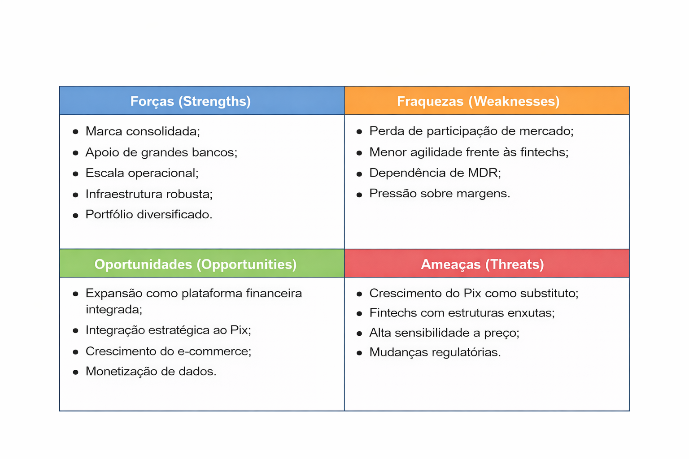 
  Fonte: Autores

#### Fatores Internos

#### Forças (Strengths)

- Marca consolidada;
- Apoio de grandes bancos;
- Escala operacional;
- Infraestrutura robusta;
- Portfólio diversificado.

#### Fraquezas (Weaknesses)

- Perda de participação de mercado em consequência ao custo operacional elevado;
- Menor agilidade frente às fintechs;
- Dependência de MDR;
- Pressão sobre margens.

#### Fatores Externos

#### Oportunidades (Opportunities)

- Expansão como plataforma financeira integrada;
- Integração estratégica ao Pix; crescimento do e-commerce;
- Monetização de dados.

#### Ameaças (Threats)

- Crescimento do Pix como substituto;
- Fintechs com estruturas enxutas;
- Alta sensibilidade a preço;
- Mudanças regulatórias.

#### Explicação da Análise SWOT:

A Cielo detém liderança histórica e suporte bancário robusto, garantindo escala e credibilidade (Cielo S.A., 2024). Contudo, enfrenta fraquezas como a perda de market share e menor agilidade frente a fintechs (Prudenciano, 2025). O cenário externo apresenta oportunidades na evolução para uma plataforma financeira integrada e no uso estratégico de dados (Banco Central, 2023). Em contrapartida, o Pix e a agressividade de novos entrantes são ameaças estruturais que pressionam margens (Teles, 2025). Assim, a Cielo busca equilibrar sua infraestrutura tradicional com a inovação digital para manter sua competitividade.

### 1.1.3. Missão / Visão / Valores (sprint 2)

**Missão**
Criar um jogo de treinamento que desenvolva, de forma prática e interativa, as habilidades de comunicação, negociação e estratégia dos vendedores, preparando-os para enfrentar situações reais do mercado com mais confiança e desempenho.

**Visão**
Tornar-se uma ferramenta de capacitação que complemente os treinamentos tradicionais, unindo tecnologia e gamificação para melhorar a performance comercial e os resultados da equipe de vendas.

**Valores**
Compromisso com o desenvolvimento profissional, foco em resultados, aprendizado contínuo, inovação no treinamento e ética nas relações comerciais.

### 1.1.4. Proposta de Valor (sprint 4)

  Proposta de Valor 
  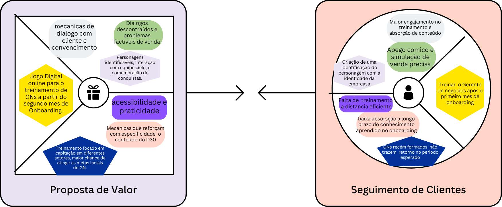 
  Fonte: Autores

#### Documento de Estrutura: Jogo de Treinamento para GNs (Cielo)

#### Visão Geral do Projeto

**Objetivo:** Desenvolver um jogo digital online voltado para o treinamento de Gerentes de Negócios (GNs) da Cielo, com foco na transição entre o onboarding inicial e a prática de mercado (a partir do segundo mês).

#### Segmento de Clientes (O Perfil do GN)

Nesta seção, detalhamos o perfil do profissional e os desafios que ele enfrenta no início da carreira na Cielo.

#### Tarefas do Cliente (Customer Jobs)

**Capacitação Contínua:** Treinar e especializar o Gerente de Negócios após a conclusão do primeiro mês de onboarding.
Performance: Atingir as metas iniciais de vendas e prospecção.

#### Dores (Pains)

**Lacuna no Ensino Remoto:** Inexistência ou falta de eficiência em treinamentos à distância.
Baixa Retenção: Dificuldade em absorver e aplicar a longo prazo o conteúdo técnico aprendido no onboarding
Rampagem Lenta: GNs recém-formados que demoram a trazer o retorno financeiro esperado pela companhia.

#### Ganhos Esperados (Gains)

**Engajamento:** Aumento do interesse pelo treinamento e melhor absorção do conteúdo didático.
Prática Simulada: Capacidade de simular vendas com precisão e tom cômico/leve para reduzir o estresse.
Cultura e Identidade: Fortalecimento da identificação do colaborador com a marca e cultura Cielo através dos personagens.

#### Proposta de Valor (A Solução Gameficada)

Aqui descrevemos como o jogo resolve os problemas listados e entrega valor ao GN.

#### O Produto/Serviço

**Plataforma**: Jogo digital online de treinamento.
Público-alvo: GNs a partir do 2º mês de casa.

#### Aliviadores de Dor (Pain Relievers)

**Acessibilidade**: Facilidade de acesso e praticidade para jogar em qualquer lugar.
Reforço do D30: Mecânicas de jogo desenhadas especificamente para fixar o conteúdo técnico do programa D30.
Foco em Resultados: Treinamento direcionado para a captação em diferentes setores, aumentando as chances de batimento de metas.

#### Criadores de Ganho (Gain Creators)

**Soft Skills em Foco**: Mecânicas focadas em diálogos com clientes e técnicas de convencimento.
**Realismo Amigável**: Uso de problemas de vendas reais em diálogos descontraídos e factíveis.
**Gamificação Social**: Personagens identificáveis, interação simulada com a equipe Cielo e sistemas de celebração de conquistas e metas atingidas no jogo.

#### Conclusão de Alinhamento

O jogo proposto atua diretamente na "curva de esquecimento" pós-onboarding, transformando o conteúdo teórico em prática interativa. Ao simular o dia a dia do GN em um ambiente seguro e divertido, reduzimos o tempo de rampagem e aumentamos a confiança do profissional para abordar o mercado.

### 1.1.5. Descrição da Solução (Sprint 4)

### a) O problema a ser resolvido

Atualmente, a Cielo enfrenta o desafio de fornecer uma capacitação homogênea para seus Gerentes de Negócios (GNs) em escala nacional. A dispersão geográfica da força de vendas impede que treinamentos práticos de alta qualidade cheguem de forma igualitária a todas as regiões. Isso resulta em uma lacuna de aprendizado, onde o treinamento à distância atual carece de um embasamento prático e holístico que prepare o vendedor para a complexidade e a diversidade dos cenários de vendas reais encontrados em campo.

### b) A solução proposta

Para superar essa barreira, propomos a criação de um Simulador Gamificado de Vendas. Trata-se de um jogo digital _cross-platform_ (disponível para navegadores em computadores e dispositivos móveis) onde o _player_ assume o papel de um Gerente de Negócios da Cielo. Através de uma jornada imersiva, o colaborador desbrava um mapa de desafios onde aprenderá, na prática, sobre o portfólio de produtos, contextos de venda e estratégias de negociação. O núcleo do jogo foca na capacidade de convencimento e contorno de objeções de clientes de diversos setores, simulando a realidade do dia a dia comercial.

### c) Como a solução deverá ser utilizada

O jogo será integrado como pilar central do período de onboarding (primeiros três meses de treinamento). A Cielo disponibilizará a solução em seus servidores internos, incentivando os novos GNs a utilizarem a plataforma como etapa obrigatória e complementar de sua formação. A ideia é que o simulador funcione como uma ponte entre o conhecimento teórico e a prática de campo, permitindo que o gerente teste abordagens em um ambiente controlado antes de sua atuação oficial.

### d) Os benefícios trazidos pela solução proposta

- **Padronização e Dinamicidade:** Moderniza o treinamento, garantindo que o mesmo nível de excelência educacional seja entregue de ponta a ponta no Brasil, de forma interativa.
- **Identidade e Engajamento:** Estimula a criação de um sentimento comunitário e de pertencimento à cultura Cielo, utilizando elementos de gamificação para fortalecer a marca empregadora.
- **Retenção de Conhecimento Multissensorial:** Potencializa a absorção de conteúdos técnicos e comportamentais através de estímulos diversos (visuais, narrativos e práticos) que superam os métodos de aprendizado tradicionais.

### 1.1.6. Matriz de Riscos (sprint 4)

Esta seção detalha as ameaças e oportunidades identificadas para o projeto, incluindo probabilidade, impacto, responsáveis e os respectivos planos de ação baseados nas demandas de cada risco.

  Matriz de Riscos 
  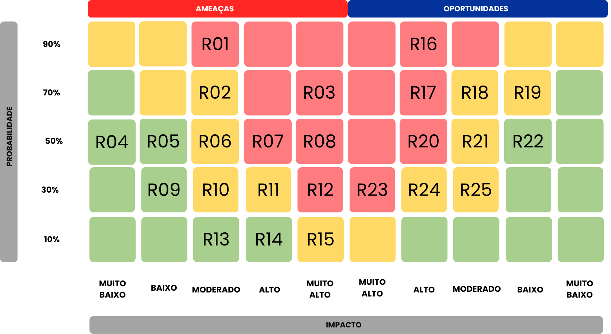 
  Fonte: Autores

## AMEAÇAS

### Probabilidade 90%

**R01: Problemas com Carregamento**

- **Impacto:** Moderado - **Vermelho**
- **Descrição:** Por ser um jogo digital com ativos visuais, a chance de lentidão no carregamento inicial é quase certa em conexões instáveis. No entanto, o impacto é considerado muito baixo porque, uma vez carregado, o fluxo da "batalha" segue normalmente, afetando apenas a paciência inicial do GN.
- **Responsável:** Vito
- **Plano de Ação:** Otimizar o tamanho dos assets e utilizar o framework Phaser de forma modular. Embora o framework seja pesado, a ação será implementar um sistema de "pre-loader" eficiente que carregue o conteúdo em segundo plano para mitigar a percepção de espera.

---

### Probabilidade 70%

**R02: Falta de acessibilidade**

- **Impacto:** Moderado - **Amarelo**
- **Descrição:** É altamente provável que existam usuários com necessidades específicas (como daltonismo ou deficiência visual parcial) no onboarding. O impacto é moderado porque pode impedir uma parcela dos colaboradores de concluir o treinamento de forma autônoma.
- **Responsável:** Manoel
- **Plano de Ação:** Seguir diretrizes WCAG, incluindo suporte a alto contraste e garantindo que os tipos de argumentos de venda tenham símbolos (ex: fogo, folha, raio) e não dependam apenas de cores.

**R03: Desatualização**

- **Impacto:** Muito Alto - **Vermelho**
- **Descrição:** O mercado de pagamentos da Cielo muda constantemente com novas taxas e produtos da concorrência. Ensinar uma estratégia obsoleta pode levar o GN a cometer erros reais diante do cliente.
- **Responsável:** Samuel
- **Plano de Ação:** Implementar uma integração com banco de dados externo (JSON/API). Assim, o RH altera as taxas em uma planilha e o jogo atualiza os diálogos sem necessidade de novo deploy de código.

---

### Probabilidade 50%

**R04: Substituição de modelos gamificados**

- **Impacto:** Muito Baixo - **Verde**
- **Descrição:** Chance média da empresa decidir por modelos mais tradicionais ou IAs de texto puro em vez de jogos.
- **Responsável:** José
- **Plano de Ação:** Monitorar a satisfação dos GNs nas primeiras sprints para gerar dados que comprovem a eficácia do modelo. Posteriormente, propor a implementação de um banco de dados processado por IA para diálogos discursivos.

**R05: Não absorção do conteúdo**

- **Impacto:** Baixo - **Amarelo**
- **Descrição:** Risco de o jogador focar apenas em vencer o "combate" e ignorar a teoria. A mecânica de tipos exige compreensão, mas o aprendizado pode ser superficial.
- **Responsável:** Bernardo
- **Plano de Ação:** Implementar o "Feedback de Combate". Sempre que o GN escolher um argumento, o jogo deve exibir uma pequena caixa de texto justificando tecnicamente por que aquele argumento foi eficaz ou não.

**R06: Curva de aprendizado não otimizada**

- **Impacto:** Moderado - **Amarelo**
- **Descrição:** Metade dos novos GNs pode ter dificuldade inicial com as mecânicas de RPG, exigindo suporte extra no primeiro contato.
- **Responsável:** Bernardo
- **Plano de Ação:** Desenvolver um "Mundo Tutorial" (Mundo 0) obrigatório e intuitivo, focado exclusivamente no ensino dos controles e na lógica da barra de convencimento.

**R07: Ocorrência de falhas em diferentes dispositivos**

- **Impacto:** Alto - **Vermelho**
- **Descrição:** GNs usam diversos modelos de celulares e tablets. Falhas técnicas geram frustração e percepção de falta de profissionalismo.
- **Responsável:** Vito
- **Plano de Ação:** Realizar testes de compatibilidade (Smoke Tests) nos dispositivos padrão da Cielo e nos modelos Android/iOS mais comuns do mercado antes do lançamento final.

**R08: Falta de disponibilidade de dispositivos compatíveis**

- **Impacto:** Muito Alto - **Vermelho**
- **Descrição:** Se o jogo exigir hardware potente que o GN não possui, o projeto para. É um risco crítico de infraestrutura.
- **Responsável:** Felipe
- **Plano de Ação:** Conscientizar a equipe Cielo sobre a necessidade de disponibilizar dispositivos adequados e otimizar o código para que o jogo seja funcional mesmo em aparelhos de entrada.

---

### Probabilidade 30%

**R09: Bugs com Carregamento de progresso**

- **Impacto:** Baixo - **Verde**
- **Descrição:** Perda eventual do último "save". Impacto baixo pois o reforço da lição ao repetir a fase pode ser benéfico.
- **Responsável:** Vito
- **Plano de Ação:** Implementar um sistema de salvamento em nuvem vinculado ao ID/CPF do funcionário, com backup automático a cada transição de cenário.

**R10: Falhas do sistema de hospedagem**

- **Impacto:** Moderado - **Amarelo**
- **Descrição:** Queda de servidores paralisando o treinamento de turmas inteiras.
- **Responsável:** Samuel
- **Plano de Ação:** Sugerir o uso de serviços de nuvem com alta disponibilidade (AWS/Azure) e configurar alertas de instabilidade para a equipe técnica.

**R11: Perdas na experiência devido a bugs**

- **Impacto:** Alto - **Amarelo**
- **Descrição:** Bugs visuais ou de interface que retiram a imersão e diminuem a seriedade do treinamento.
- **Responsável:** Manoel
- **Plano de Ação:** Estabelecer um canal de feedback rápido ("Reportar Bug") dentro do jogo para que os GNs avisem sobre falhas gráficas imediatamente.

**R12: Vício em Mecânicas/Grinding**

- **Impacto:** Muito Alto - **Vermelho**
- **Descrição:** O jogador foca em repetir batalhas fáceis para subir de nível sem aprender nada novo, destruindo o valor educacional.
- **Responsável:** Bernardo
- **Plano de Ação:** Aplicar um sistema de "XP Decrescente", onde repetir o mesmo desafio muitas vezes deixa de dar recompensa, forçando o avanço para novos setores.

---

### Probabilidade 10%

**R13: Baixa familiaridade dos gerentes**

- **Impacto:** Moderado - **Verde**
- **Descrição:** Risco baixo de rejeição ao estilo "Pokémon", dado o apelo nostálgico e a difusão da gamificação.
- **Responsável:** José
- **Plano de Ação:** Caprichar no storytelling inicial, conectando a jornada do treinador à jornada real de sucesso financeiro e metas batidas na Cielo.

**R14: Falta de adesão devido a falta de estímulos**

- **Impacto:** Alto - **Verde**
- **Descrição:** Risco de o GN ignorar o jogo se não houver obrigatoriedade ou incentivo claro.
- **Responsável:** Miguel
- **Plano de Ação:** Criar recompensas digitais (badges/medalhas) que sejam visíveis no perfil do funcionário perante seus gestores e pares.

**R15: Não compreensão dos controles pelos GNs**

- **Impacto:** Muito Alto - **Amarelo**
- **Descrição:** O jogador não conseguir interagir com o jogo devido a uma interface confusa.
- **Responsável:** Miguel
- **Plano de Ação:** Implementar uma interface minimalista com ícones universais e indicadores visuais (botões que brilham no primeiro uso) para guiar o usuário.

---

## OPORTUNIDADES

### Probabilidade 90%

**R16: Identificação de gaps de conhecimento**

- **Impacto:** Moderado - **Verde** (Nota: Ajustado de Vermelho para Verde por ser positivo)
- **Descrição:** O jogo fornecerá dados preciosos sobre quais argumentos de venda os GNs mais erram.
- **Responsável:** Bernardo
- **Plano de Ação:** Implementar uma ferramenta de analytics que exporta relatórios para o RH indicando em qual setor (Mundo) os GNs estão tendo mais dificuldade de argumentação.

---

### Probabilidade 70%

**R17: Aumento de Confiança do Gerente**

- **Impacto:** Alto - **Verde** (Nota: Ajustado de Vermelho para Verde por ser positivo)
- **Descrição:** Treinar diálogos em ambiente seguro aumenta a fluidez e segurança do GN na abordagem porta-a-porta.
- **Responsável:** Samuel
- **Plano de Ação:** Incluir uma "Barra de Confiança" que concede bônus de persuasão no jogo, reforçando psicologicamente o acerto do argumento correto.

**R18: Sucesso e posterior expansão**

- **Impacto:** Moderado - **Amarelo**
- **Descrição:** Possibilidade de levar o modelo de jogo para outras áreas da empresa.
- **Responsável:** Manoel
- **Plano de Ação:** Coletar métricas de tempo de conclusão e nota final para apresentar um relatório de ROI (Retorno sobre Investimento) para a diretoria da Cielo.

**R19: Acessibilidade em tablets e notebooks**

- **Impacto:** Baixo - **Amarelo**
- **Descrição:** Chance de permitir o uso em múltiplas telas, melhorando a percepção de modernidade.
- **Responsável:** Vito
- **Plano de Ação:** Garantir que o design da interface seja responsivo para diferentes proporções de tela através do framework Phaser.

---

### Probabilidade 50%

**R20: Adaptabilidade do modelo**

- **Impacto:** Alto - **Verde** (Nota: Ajustado de Vermelho para Verde por ser positivo)
- **Descrição:** O motor do jogo pode ser usado para treinar novos produtos rapidamente frente à concorrência.
- **Responsável:** Miguel
- **Plano de Ação:** Documentar o código de forma modular, permitindo a inclusão de novos "Mundos" ou produtos com baixo esforço técnico.

**R21: Compreensão dos setores**

- **Impacto:** Moderado - **Amarelo**
- **Descrição:** Melhor entendimento das dores específicas de cada segmento comercial (Varejo, Alimentação, etc).
- **Responsável:** Felipe
- **Plano de Ação:** Personalizar os NPCs (clientes) com diálogos e cenários que reflitam as dores reais de cada setor geográfico/comercial.

**R22: Redução de custos**

- **Impacto:** Baixo - **Verde**
- **Descrição:** Diminuição de gastos com treinamentos presenciais e instrutores para conteúdos básicos.
- **Responsável:** Samuel
- **Plano de Ação:** Automatizar a correção dos testes de conhecimento e a emissão de certificados de conclusão diretamente pelo sistema do jogo.

---

### Probabilidade 30%

**R23: Retorno financeiro à Cielo**

- **Impacto:** Muito Alto - **Verde** (Nota: Ajustado de Vermelho para Verde por ser positivo)
- **Descrição:** Impacto direto no faturamento final através de vendas mais qualificadas.
- **Responsável:** Bernardo
- **Plano de Ação:** Vincular o progresso no jogo (Nível 9) a incentivos reais no mundo físico, como premiações ou pontuação em rankings internos.

**R24: Implementação sistema de rankeamento**

- **Impacto:** Alto - **Amarelo**
- **Descrição:** Estímulo à competição saudável e engajamento.
- **Responsável:** Vito
- **Plano de Ação:** Criar um "Hall da Fama" para destacar os GNs que atingiram o nível de maturidade máxima com melhor aproveitamento.

**R25: Redução no Turnover pós Onboarding**

- **Impacto:** Moderado - **Amarelo**
- **Descrição:** Um processo de integração lúdico aumenta a retenção do colaborador no primeiro mês.
- **Responsável:** Felipe
- **Plano de Ação:** Inserir mensagens de valorização da profissão e conquistas narrativas que aumentem o senso de pertencimento do GN à Cielo.

### 1.1.7. Objetivos, Metas e Indicadores (sprint 4)

### Objetivo 1.⁠ ⁠Garantir equidade e acesso ao treinamento em todo o Brasil

#### Meta 1.1 – Acessibilidade multiplataforma

- Garantir que o jogo funcione em **100% dos principais navegadores modernos** (Chrome, Edge, Safari)
- Compatibilidade com **desktop e mobile**
- **Prazo:** até o final da Sprint 4

#### Meta 1.2 – Alcance geográfico

- Permitir acesso ao jogo em todas as regiões do Brasil
- Pelo menos **90% dos usuários** consigam acessar sem barreiras técnicas
- **Prazo:** durante fase de testes (Sprint 5)

#### Meta 1.3 – Facilidade de acesso

- Reduzir barreiras de entrada com sistema simples (sem login complexo)
- Garantir que **95% dos usuários** consigam iniciar o jogo em menos de 2 minutos
- **Prazo:** Sprint 4

---

#### KPIs (Indicadores)

- Taxa de acesso bem-sucedido (%)
- Taxa de compatibilidade por dispositivo (%)
- Tempo médio até iniciar o jogo (min)
- Taxa de erro de acesso (%)

---

### Objetivo 2.⁠ ⁠Aumentar o engajamento no treinamento

#### Meta 2.1 – Retenção de jogadores

- Garantir que **70% dos jogadores** completem o tutorial
- **Prazo:** testes (Sprint 5)

#### Meta 2.2 – Progressão no jogo

- Pelo menos **60% dos jogadores** completem 2 ou mais mundos
- **Prazo:** Sprint 5

#### Meta 2.3 – Tempo de uso

- Alcançar tempo médio de sessão **≥ 15 minutos**
- **Prazo:** testes finais

#### Meta 2.4 – Motivação contínua

- Implementar sistema de recompensas e conquistas funcional
- Pelo menos **65% dos jogadores** interajam com o sistema de progressão
- **Prazo:** Sprint 4

---

#### KPIs (Indicadores)

- Taxa de conclusão do tutorial (%)
- Tempo médio de sessão (min)
- Número médio de sessões por usuário

---

### Objetivo 3.⁠ ⁠Desenvolver habilidades e técnicas comerciais avançadas

#### Meta 3.1 – Melhoria na tomada de decisão

- Aumentar em **30% a taxa de acerto** nas decisões de venda
- Comparando início vs. final do jogo
- **Prazo:** Sprint 5

#### Meta 3.2 – Eficiência nas interações

- Garantir que **60% dos jogadores** tenham sucesso em pelo menos 70% das vendas
- **Prazo:** testes finais

#### Meta 3.3 – Aprendizado progressivo

- Implementar feedback educativo em **100% das interações**
- **Prazo:** sprint 4 (MVP)

#### Meta 3.4 – Adaptação a diferentes clientes

- Jogadores devem interagir com pelo menos **3 perfis diferentes** de clientes

---

#### KPIs (Indicadores)

- Taxa de acerto nas decisões (%)
- Taxa de sucesso em vendas (%)
- Quantidade de interações corretas vs incorretas

## 1.2. Requisitos do Projeto (sprints 1 e 2)

| \#   | Requisito                                                                                                                                |
| ---- | ---------------------------------------------------------------------------------------------------------------------------------------- |
| RF01 | O sistema deve permitir que o jogador realize um cadastro simples, registrando seu nome antes de iniciar o jogo.                         |
| RF02 | O sistema deve apresentar uma tela inicial contendo as opções de iniciar o jogo, visualizar conquistas e sair.                           |
| RF03 | O sistema deve possuir um tutorial inicial que explique ao jogador os controles básicos e o objetivo do jogo.                            |
| RF04 | O sistema deve permitir que o jogador interaja com clientes (NPCs – Non Playable Characters, personagens não jogáveis) durante as fases. |
| RF05 | O sistema deve permitir que o jogador escolha argumentos de venda durante as interações com clientes.                                    |
| RF06 | O sistema deve registrar as interações e decisões do jogador durante as fases do jogo.                                                   |
| RF07 | O sistema deve apresentar um relatório de desempenho ao final das fases, mostrando como o jogador se saiu nas interações de venda.       |
| RF08 | O sistema deve apresentar feedback educativo após as interações, explicando se a escolha do jogador foi adequada ou não.                 |
| RF09 | O jogo deverá possuir uma tela de configurações para ajustar volume                                                                      |
| RG01 | O jogo deve possuir diferentes fases que representem situações de venda, simulando ambientes onde vendedores podem encontrar clientes.   |
| RG02 | Cada fase deve apresentar clientes com diferentes perfis, exigindo estratégias de venda diferentes.                                      |
| RG03 | O jogador deve progredir no jogo ao completar interações de venda com sucesso.                                                           |
| RG04 | O jogo deve possuir um sistema de recompensas, permitindo que novas fases sejam desbloqueadas conforme o progresso do jogador.           |
| RG05 | O jogo deve permitir que o jogador explore cenários abertos, interagindo com clientes e elementos do ambiente.                           |
| RG06 | O jogo deve oferecer personagens jogáveis com variações visuais (cosméticas), permitindo personalização simples do avatar.               |
| RT01 | O sistema deve ser executado em navegadores web, permitindo acesso em computadores e dispositivos móveis.                                |
| RT02 | O jogo deve permitir movimentação do personagem utilizando teclado, por meio das teclas WASD ou setas direcionais.                       |
| RT03 | O sistema deve registrar dados básicos de interação para possibilitar análise de desempenho do jogador durante o jogo.                   |

- RF — Requisitos Funcionais (RF – Functional Requirements): funcionalidades que o sistema do jogo precisa executar.
- RG — Requisitos de Gameplay (RG – Gameplay Requirements): regras e mecânicas relacionadas à experiência do jogador.
- RT — Requisitos Técnicos (RT – Technical Requirements): aspectos técnicos necessários para que o jogo funcione corretamente.

## 1.3. Público-alvo do Projeto (sprint 2)

O público-alvo do jogo Jornada Cielo são pessoas interessadas em aprender ou desenvolver habilidades relacionadas a vendas e atendimento ao cliente.

O jogo foi pensado principalmente para:

- novos vendedores ou pessoas em processo de treinamento
- estudantes interessados em aprender conceitos básicos de negociação
- pessoas que trabalham com atendimento ao público

A faixa etária estimada para o público do jogo é entre 18 e 40 anos, considerando que a proposta do jogo envolve situações profissionais de venda.

O objetivo do jogo é apresentar de forma simples e interativa algumas situações que vendedores podem enfrentar no dia a dia, permitindo que o jogador pratique a escolha de argumentos e estratégias de venda.

# 2. Visão Geral do Jogo (sprint 2)

## 2.1. Objetivos do Jogo (sprint 2)

O objetivo do jogo digital Jornada Cielo é apoiar o treinamento de vendedores da Cielo, tornando o processo de aprendizagem mais dinâmico, interativo e envolvente.

A proposta do jogo é simular situações comuns do processo de vendas, permitindo que os jogadores pratiquem habilidades importantes como:

- comunicação com clientes
- argumentação comercial
- tomada de decisão durante negociações
- escolha de abordagens de venda adequadas para cada tipo de cliente

O jogo foi inspirado nos jogos físicos utilizados pela Cielo em treinamentos presenciais, que simulam interações de venda entre consultores e clientes. A adaptação para o formato digital busca ampliar essa experiência, permitindo que os vendedores possam praticar essas situações de forma mais acessível, repetível e interativa.

Com isso, o jogo pretende contribuir para que os vendedores se sintam mais confiantes e preparados para situações reais de venda, fortalecendo suas habilidades comerciais durante o processo de treinamento.

## 2.2. Características do Jogo (sprint 2)

### 2.2.1. Gênero do Jogo (sprint 2)

O jogo Jornada Cielo pode ser classificado principalmente nos gêneros de:

- Aventura
- Estratégia

O elemento de aventura está relacionado à exploração do cenário e à progressão entre diferentes fases e áreas do jogo.

Já o elemento de estratégia aparece nas interações com clientes, nas quais o jogador precisa escolher argumentos e respostas adequadas para convencer o cliente a adquirir os produtos da Cielo.

Além disso, o jogo também possui características de Serious Game (Jogo Educacional), pois seu objetivo principal é apoiar o processo de treinamento e desenvolvimento de habilidades profissionais.

### 2.2.2. Plataforma do Jogo (sprint 2)

O jogo foi desenvolvido para ser acessado através de navegadores de internet, permitindo que ele seja jogado sem a necessidade de instalação.

As plataformas compatíveis incluem:

- Computadores (desktop)
- Tablets
- Celulares (smartphones)

Por utilizar tecnologia baseada em navegador, o jogo pode ser executado em diferentes navegadores modernos, facilitando o acesso pelos usuários durante o processo de treinamento.

### 2.2.3. Número de jogadores (sprint 2)

O jogo foi projetado para um único jogador, sendo classificado como singleplayer.

Nesse formato, o jogador interage diretamente com o ambiente do jogo e com os NPCs (Non Player Characters – personagens controlados pelo jogo) que representam possíveis clientes.

Essa escolha permite que o jogador se concentre nas situações de venda apresentadas, tomando decisões individuais durante as interações.

### 2.2.4. Títulos semelhantes e inspirações (sprint 2)

Alguns jogos serviram como referência para determinadas mecânicas e ideias utilizadas no desenvolvimento do Jornada Cielo.

Entre eles destacam-se:

- Pokémon FireRed – utilizado como inspiração para a ideia de exploração de mundo e interação com personagens dentro do cenário.
- Super Mario World – utilizado como referência para a estrutura de progressão entre mundos e fases.

Essas inspirações ajudaram a pensar na organização da progressão do jogo e na forma como o jogador se movimenta e interage com o ambiente.

### 2.2.5. Tempo estimado de jogo (sprint 5)

O tempo estimado para concluir todas as fases do jogo Jornada Cielo é de aproximadamente 1 hora.

Cada fase possui uma duração média entre 10 e 15 minutos, dependendo do ritmo do jogador e das escolhas realizadas durante as interações com os clientes.

Esse tempo foi pensado para que o jogo possa ser utilizado de forma prática em contextos de treinamento, permitindo que os jogadores completem sessões de jogo dentro de períodos curtos de aprendizagem.

# 3. Game Design (sprints 2 e 3)

## 3.1. Enredo do Jogo (sprints 2 e 3)

O jogo **Jornada Cielo** se passa em um grande mapa dividido em diferentes **setores de vendas**, que representam os diversos cenários encontrados no mercado brasileiro. Cada setor funciona como um ambiente onde o jogador enfrenta desafios que simulam situações reais do cotidiano de um profissional da área comercial.

Durante o jogo, o jogador percorre esses ambientes realizando interações com possíveis clientes, enfrentando concorrentes e resolvendo situações que exigem **boa comunicação, estratégia e capacidade de negociação**.

No início da jornada, o jogador escolhe um personagem que representa um **Gerente de Negócios (GN)** em início de treinamento profissional dentro do ecossistema da Cielo. A partir desse ponto, o personagem passa por diferentes experiências que colocam à prova suas habilidades comerciais.

Ao longo da progressão do jogo, o jogador:

- interage com diferentes perfis de clientes;
- escolhe argumentos de venda;
- enfrenta objeções e concorrência;
- aprende a adaptar sua comunicação ao contexto apresentado.

Conforme o jogador supera os desafios e obtém bons resultados nas negociações, o personagem evolui profissionalmente dentro da narrativa do jogo, demonstrando maior confiança e preparo para atuar no mercado de vendas.

Essa jornada representa o processo de desenvolvimento profissional do Gerente de Negócios, transformando o treinamento em uma experiência **interativa, prática e progressiva**.

## 3.2. Personagens (sprints 2 e 3)

### 3.2.1. Controláveis

Os personagens controláveis representam os **Gerentes de Negócios (GNs)** que estão participando do treinamento.

Esses personagens serão desenvolvidos em **modelo 2D**, utilizando **sprites (conjunto de imagens utilizadas para animar personagens em jogos)** que permitem movimentação fluida dentro do cenário.

O design visual dos personagens segue uma identidade alinhada à proposta corporativa da Cielo, utilizando principalmente **tons de azul**, que remetem à identidade visual da empresa.

O jogador poderá escolher entre diferentes personagens pré-customizados.

Essa possibilidade de escolha permite maior **identificação do jogador com o avatar**, tornando a experiência mais personalizada e imersiva.

  Idle 
  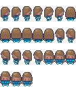 
  Fonte: Autores

 

  Amelia 
  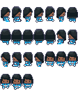 
  Fonte: Autores

 

  Amelia 
  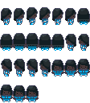 
  Fonte: Autores

 

  Bob 
  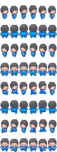 
  Fonte: Autores

 

### 3.2.2. Non-Playable Characters (NPC)

Os **NPCs (Non-Playable Characters – personagens controlados pelo jogo)** representam os personagens que interagem com o jogador ao longo das fases.

Os principais tipos de NPCs presentes no jogo são:

**Clientes**

Os clientes apresentam diferentes perfis, necessidades e objeções, criando situações variadas de negociação. Cada cliente exige que o jogador utilize **estratégias adequadas de comunicação e argumentação** para realizar a venda.

### 3.2.3. Diversidade e Representatividade dos Personagens

Os personagens do jogo foram planejados para refletir a diversidade presente no mercado de trabalho brasileiro e no público-alvo do projeto.

O jogo disponibiliza **seis opções de personagens principais**, permitindo escolha entre:

- personagens masculinos e femininos
- variações de cor de pele (branca, parda e negra)

Essa diversidade busca representar diferentes perfis da sociedade brasileira, aumentando a identificação dos jogadores com os personagens disponíveis.

Os NPCs também foram projetados para representar diferentes perfis de clientes, incluindo variações de:

- idade
- aparência
- estilo de negócio

A concepção dos personagens não foi apenas estética, mas também uma decisão alinhada à realidade social e profissional do Brasil.

#### Representatividade Étnico-Racial

A presença de personagens com diferentes tons de pele reflete a composição da população brasileira. Segundo dados do **IBGE (Instituto Brasileiro de Geografia e Estatística)** no **Censo de 2022**, grande parte da população brasileira se autodeclara parda.

Ao permitir que o consultor escolha um personagem com características semelhantes às suas, o jogo promove maior identificação com a experiência e aumenta o engajamento durante o treinamento.

Fonte:
https://agenciadenoticias.ibge.gov.br

#### Equidade de Gênero no Cenário Corporativo

O jogo também inclui personagens femininos e masculinos em papéis profissionais relevantes, reforçando a ideia de equidade de gênero no ambiente corporativo.

Segundo dados do **IBGE**, apesar de avanços recentes, ainda existem diferenças de participação e remuneração entre homens e mulheres no mercado de trabalho.

Apresentar personagens femininas atuando ativamente em negociações comerciais ajuda a reforçar a importância da equidade de oportunidades dentro das empresas.

Fonte:
https://movimentomulher360.com.br

#### Realidade do Ecossistema de Clientes

Os clientes e concorrentes também representam diferentes perfis de empreendedores brasileiros.

Dados do **SEBRAE (Serviço Brasileiro de Apoio às Micro e Pequenas Empresas)** mostram que o Brasil possui grande diversidade de empreendedores, incluindo mulheres, jovens e pessoas de diferentes origens sociais.

Ao interagir com clientes diversos, o jogador treina habilidades importantes como:

- empatia
- adaptação da comunicação
- leitura de contexto

Essas competências são essenciais para profissionais de vendas que atuam em um país com grande diversidade cultural e econômica.

## 3.3. Mundo do jogo (sprints 2 e 3)

### 3.3.1. Locações Principais e/ou Mapas (sprints 2 e 3)

O universo do jogo é inspirado na atuação nacional da Cielo e na diversidade de ambientes comerciais presentes no Brasil.

**Ponto de partida**

Todas as jornadas começam no **Centro Cielo**, que funciona como o espaço inicial do treinamento e ponto de organização das atividades do jogador.

**Ambientes de venda**

Durante o jogo, o jogador poderá explorar diferentes tipos de estabelecimentos comerciais, como:

- mercados
- padarias
- restaurantes
- lojas
- centros comerciais
- shoppings
- indústria

Esses ambientes representam diferentes contextos de venda, cada um com desafios e perfis de clientes específicos.

**Identidade visual**

Cada região do jogo pode apresentar características visuais que lembram diferentes regiões brasileiras, permitindo que o treinamento seja contextualizado de forma mais próxima da realidade do trabalho do Gerente de Negócios.

### 3.3.2. Navegação pelo mundo (sprints 2 e 3)

A navegação pelo mundo do jogo foi pensada para representar o crescimento do profissional ao longo de sua jornada.

**Mapa geral (Overworld)**

O jogo utiliza um mapa geral que conecta as diferentes fases e ambientes. Esse mapa funciona como uma interface de progressão, permitindo que o jogador visualize quais áreas já foram concluídas e quais ainda estão disponíveis.

**Sistema de desbloqueio**

Novas áreas são desbloqueadas conforme o jogador completa desafios anteriores com sucesso. Esse sistema representa o avanço do gerente na conquista de novos clientes e territórios de atuação.

**Transições de ambiente**

A movimentação entre diferentes espaços (por exemplo, entrar em uma loja ou acessar um novo ambiente) ocorre através de pontos de interação como portas ou áreas de transição no mapa.

### 3.3.3. Condições climáticas e temporais (sprints 2 e 3)

Em algumas fases do jogo existe um **limite de tempo** para que o jogador conclua determinados objetivos.

Essa mecânica representa a pressão comum do ambiente de vendas, onde profissionais precisam cumprir metas dentro de prazos específicos.

O uso de um contador de tempo estimula o jogador a:

- priorizar estratégias eficientes
- tomar decisões rápidas
- melhorar sua capacidade de argumentação em situações de pressão.

### 3.3.4. Concept Art (sprint 2)

Durante o planejamento do jogo foram criadas diversas **concept arts (artes conceituais)** que representam ideias visuais para diferentes elementos da experiência.

Entre as imagens produzidas estão representações de:

- tela de cadastro do jogador;
- sistema de navegação e acesso ao jogo;
- mecânica de diálogo com clientes;
- barra de missão e interface do jogador;
- seleção de mundos;
- progressão de fases;
- interação entre vendedor e cliente.

Essas imagens foram utilizadas como referência visual para o desenvolvimento do projeto e ajudam a ilustrar como o jogo foi planejado antes da implementação final.

As imagens utilizadas nesta seção foram **geradas com o auxílio de ferramentas de Inteligência Artificial (IA)**.

  Cadastro do jogador 
  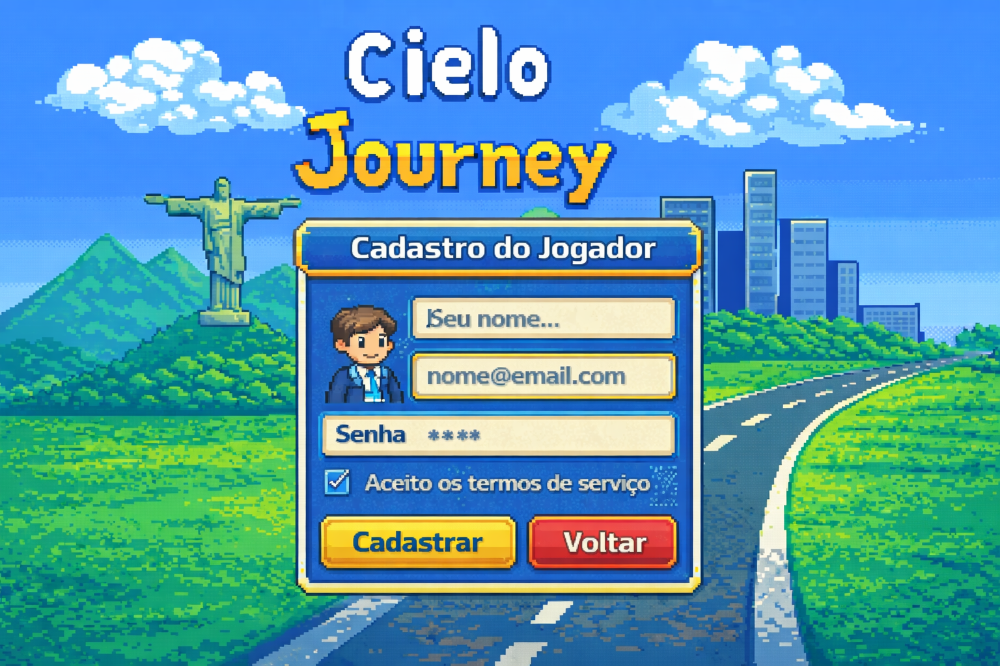 
  Fonte: Autores/Gemini

 

Imagem que representa cadastro do jogador, possibilitando que o progresso seja salvo.
 

  Visão geral do jogo 
  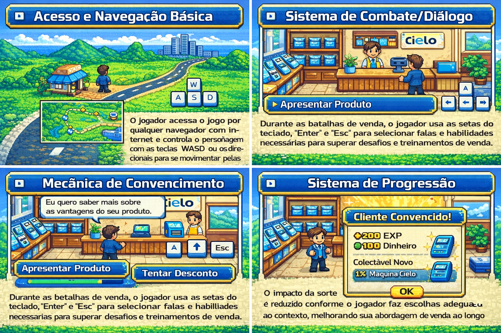 
  Fonte: Autores/Gemini

 

Concept art que resume aspectos gerais do jogo, incluindo acesso e navegação básica, sistema de diálogo, mecânica de convencimento, sistemas de progresso.
 

  Interação básica do jogo 
  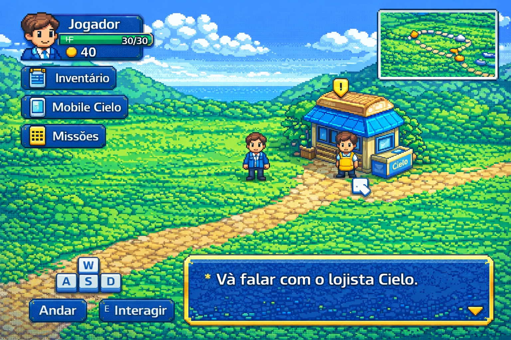 
  Fonte: Autores/Gemini

 

Concept que representa uma interação básica do jogo, mostrando barra de missão, mobile Cielo, inventário e barra de experiência.
 

  Seleção de mundo 
  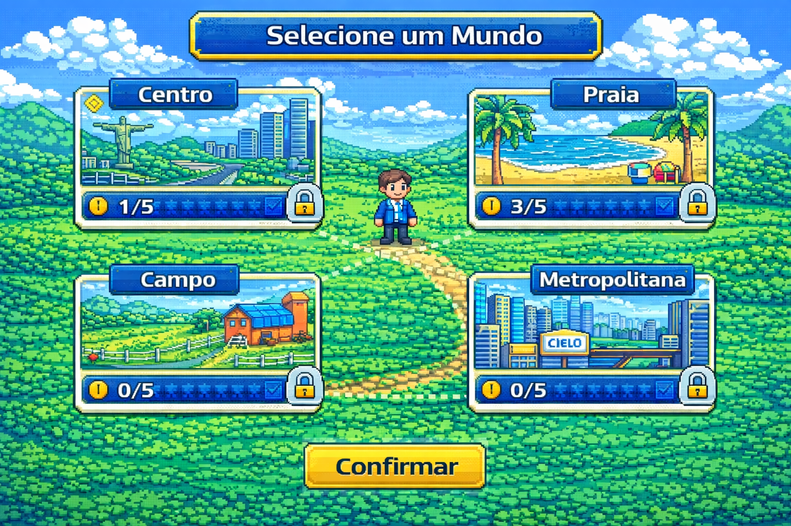 
  Fonte: Autores/Gemini

 

Imagem que demonstra uma ideia de seleção de mundo, nessa imagem as opções são regiões urbanas, porém, após reunião do grupo, os mundos representarão GEO's da CIELO.
 

  Progressão de fases 
  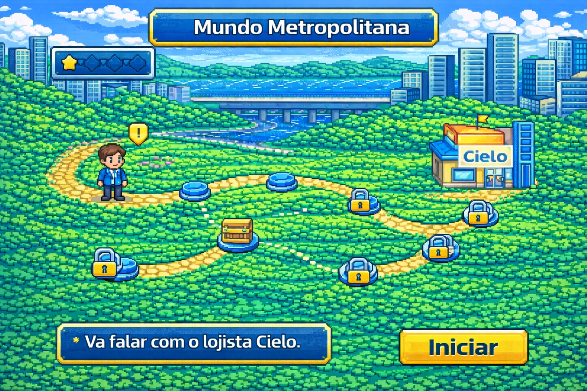 
  Fonte: Autores/Gemini

 

Imagem que representa a progressão de fases, que serão usadas para aumentar o nível de experiência do gerente de vendas.
 

  Interação vendedor e cliente 
  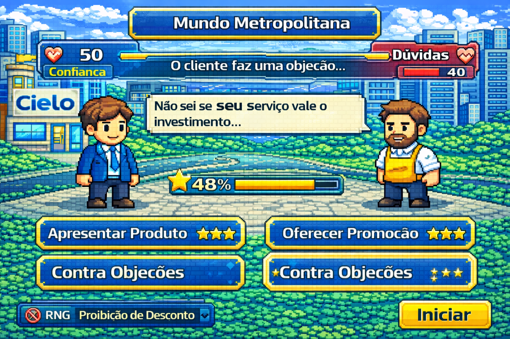 
  Fonte: Autores/Gemini

 

Imagem que representa uma interação do vendedor e o cliente. Essa imagem mostra os principais medidores que serão testados, como confiança e dúvidas.

### 3.3.5. Trilha sonora (sprint 4)

A trilha sonora do jogo foi projetada para reforçar a ambientação e a progressão emocional do jogador.

O jogo utiliza músicas no estilo 8-bit (chiptune), inspiradas em jogos clássicos como Pokémon e Super Mario.

| #   | Título             | Ocorrência                        | Autoria |
| --- | ------------------ | --------------------------------- | ------- |
| 1   | Tema de abertura   | Tela inicial do jogo              | Própria |
| 3   | Tema de interação  | Durante a negociação com clientes | Própria |
| 4   | Tema Central Cielo | Durante o mapa Geo                | Própria |
| 5   | Tema Praia         | Durante o mapa Praia              | Própria |
| 6   | Tema Indústria     | Durante o mapa Indústria          | Própria |
| 7   | Tema Cidade        | Durante o mapa Cidade             | Própria |

Cada mapa possui uma trilha ambiente específica, refletindo seu contexto:

- Cidade: ritmo dinâmico e comercial
- Praia: leve e relaxante
- Indústria: mais tenso e mecânico

Durante negociações, uma trilha base é utilizada com variações de intensidade (BPM), aumentando conforme o nível de desafio.

## 3.4. Inventário e Bestiário (sprint 3)

### 3.4.1. Inventário

O inventário representa os **recursos e argumentos de venda** que o jogador pode utilizar durante as interações com clientes.

| #   | Item                  | Como obter                                                 | Função                                      |
| --- | --------------------- | ---------------------------------------------------------- | ------------------------------------------- |
| 1   | Argumento de venda    | Obtido ao concluir fases                                   | Utilizado durante negociações com clientes  |
| 2   | Informação de produto | Liberada durante o progresso no jogo                       | Ajuda a convencer clientes durante diálogos |
| 3   | Itens-chave           | Adquirido ao captar clientes e realizar vendas com sucesso | Comprovar o progresso e conquistas          |

### 3.4.2. Bestiário

O jogo **não possui inimigos no sentido tradicional**, como em jogos de ação ou combate. No entanto, existem personagens que representam desafios durante a jornada.

| #   | Personagem       | Ocorrência                | Função                                | Impacto                      |
| --- | ---------------- | ------------------------- | ------------------------------------- | ---------------------------- |
| 1   | Cliente indeciso | Diferentes fases          | Apresenta objeções durante negociação | Exige melhores argumentos    |
| 2   | Concorrente      | Algumas fases específicas | Representa empresas rivais            | Aumenta dificuldade da venda |

## 3.5. Gameflow (Diagrama de cenas) (sprint 2)

O **Gameflow** representa o fluxo geral das telas e ações do jogo, mostrando como o jogador progride dentro da experiência.

Fluxo geral do jogo:

Tela Inicial
->
Cadastro do Jogador
->
Fase Inicial / Tutorial
->
Exploração do Mapa
->
Interação com NPCs
->
Desafios de Venda
->
Desbloqueio de Novos Mundos
->
Conclusão da Jornada

Esse fluxo representa a sequência principal da experiência do jogador dentro do jogo **Jornada Cielo**.

  GameFlow - Cenas 
  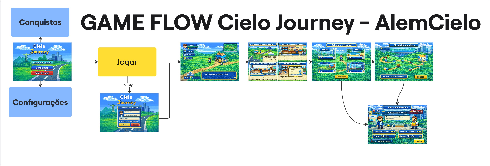 
  Fonte: Autores

 

  GameFlow 
  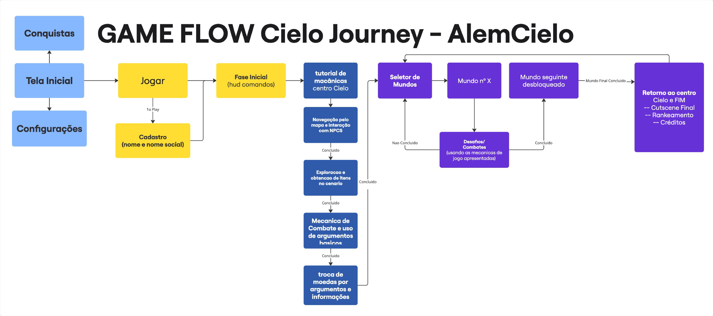 
  Fonte: Autores

 

  Diagrama de cenas e de classes 
  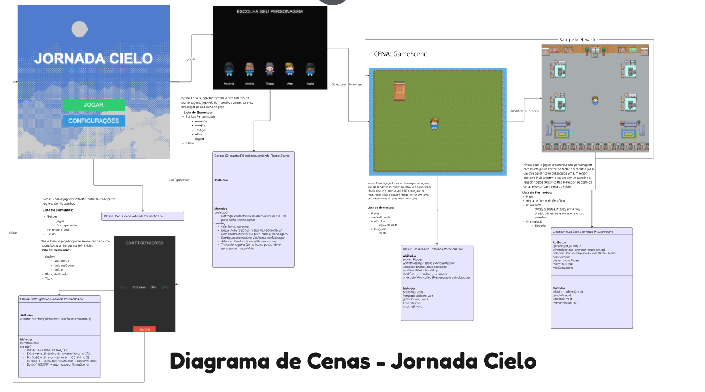 
  Fonte: Autores

 

## Explicação do GameFlow:

**Tela Inicial**

UX:
A Tela Inicial estrutura o ponto de entrada da Jornada Cielo com hierarquia visual clara e foco na ação principal. “Jogar” assume protagonismo visual, enquanto Conquistas e Configurações aparecem como rotas secundárias. Essa organização reduz ambiguidade decisória, orienta o usuário rapidamente e estabelece o início simbólico da trajetória dentro do ecossistema Cielo.

Programação:
Implementada como cena inicial controlada por um gerenciador de estados (Scene Manager). Atua exclusivamente como camada de navegação, desacoplada da lógica de jogo. Cada botão dispara eventos de transição controlados por validações condicionais, garantindo fluxo determinístico e arquitetura modular.

**Conquistas**

UX:
A área de Conquistas funciona como mecanismo de reforço comportamental. Ao tornar visível o progresso dentro da Jornada Cielo, estimula continuidade, metas claras e sensação de evolução profissional. A visualização de objetivos concluídos e pendentes cria motivação intrínseca e direcionamento de longo prazo.

Programação:
Baseia-se em um sistema de progresso global estruturado em variáveis persistentes. Cada conquista está associada a condições lógicas específicas verificadas durante a execução do jogo. O sistema realiza checagens condicionais e renderiza dinamicamente os estados desbloqueados, mantendo consistência entre sessões por meio de salvamento estruturado.

**Configurações**

UX:
Oferece personalização e acessibilidade, fortalecendo a percepção de controle do usuário sobre sua experiência. Essa camada aumenta conforto, reduz fricção e contribui para a qualidade geral da interação.

Programação:
Opera sobre um conjunto de variáveis globais de configuração. As alterações atualizam parâmetros do sistema em tempo real e são armazenadas em estrutura persistente. Funciona como camada de parametrização que influencia outros módulos sem modificar sua lógica interna.

**Jogar**

UX:
O botão “Jogar” representa a decisão ativa de iniciar a Jornada Cielo. A transição visual sinaliza mudança de estado: da navegação passiva para a experiência interativa, marcando o início efetivo da jornada.

Programação:
Dispara evento de transição de cena após validação de pré-condições. O sistema verifica existência de dados de cadastro e progresso salvo. Dependendo do estado identificado, direciona para cadastro, continuação ou fase inicial, garantindo fluxo lógico controlado por regras explícitas.

**Cadastro (Nome e Nome Social)**

UX:
O cadastro reforça inclusão e identidade, alinhando-se aos valores institucionais da Cielo. Ao permitir nome e nome social, promove pertencimento e personalização da jornada, fortalecendo o vínculo emocional com o ambiente.

Programação:
Implementado com captura de input validado. Os dados são armazenados em um objeto global do jogador, integrado ao estado da aplicação. Esse objeto passa a ser referenciado por múltiplos sistemas, como HUD, ranking e diálogos, funcionando como entidade central de dados do usuário.

**Fase Inicial — HUD e Comandos**

UX:
Momento de ambientação e aprendizado progressivo. O HUD apresenta comandos básicos de forma contextual e não invasiva, permitindo que o jogador compreenda a mecânica por experimentação. A experiência prioriza clareza, autonomia e redução de sobrecarga inicial.

Programação:
Inicializa entidades principais como Player, câmera e interface. O sistema registra listeners de entrada e associa eventos a funções de movimentação com verificação de colisão. O HUD é implementado como camada fixa independente do mapa, mantendo separação entre interface gráfica e mundo físico.

**Tutorial — Centro Cielo**

UX:
O Centro Cielo funciona como espaço seguro de aprendizagem e simboliza o início da trajetória profissional dentro do ecossistema Cielo. A progressão ocorre de forma guiada, porém exploratória, permitindo que o jogador compreenda mecânicas antes de enfrentar desafios mais complexos.

Programação:
Mapa estruturado com sistema de colisões e objetos interativos. Cada etapa do tutorial é controlada por variáveis de estado sequenciais. Eventos e interações só são liberados quando condições anteriores são satisfeitas, configurando uma progressão controlada por uma lógica de máquina de estados simplificada.

**Navegação e Interação com NPCs**

UX:
Estimula exploração ativa e construção narrativa contextual. NPCs funcionam como pontos de orientação estratégica e reforço conceitual da proposta da Cielo.

Programação:
Utiliza detecção de sobreposição entre Player e áreas interativas. Ao acionar comando de interação, o sistema dispara eventos condicionais que podem abrir diálogos, atualizar variáveis de missão ou liberar novos objetivos. Cada NPC atua como módulo orientado a eventos, com responsabilidades bem definidas.

**Exploração e Obtenção de Itens**

UX:
Introduz senso de recompensa e descoberta. A coleta de itens simboliza aquisição de conhecimento e recursos estratégicos dentro da jornada profissional.

Programação:
Itens são instanciados como objetos com detecção específica de colisão. Ao coletados, executam rotina de remoção da cena e atualização do inventário global. O inventário opera como estrutura de dados centralizada que alimenta sistemas como combate e trocas, garantindo consistência lógica.

**Mecânica de Combate e Uso de Argumentos**

UX:
Os combates representam desafios do mercado. O uso de “argumentos” simboliza competências estratégicas, conectando gameplay e proposta conceitual da Jornada Cielo.

Programação:
Baseado em sistema de ações com verificação de pré-condições, como disponibilidade de recurso e estado do inimigo. A lógica avalia entradas do jogador, executa cálculo de efeito e atualiza atributos das entidades envolvidas. O sistema opera de forma orientada a estados, garantindo previsibilidade e controle do fluxo.

**Troca de Moedas por Argumentos**

UX:
Reforça tomada de decisão estratégica. O jogador administra recursos para evoluir, simulando escolhas profissionais alinhadas ao contexto da Cielo.

Programação:
Implementa sistema de economia baseado em variáveis numéricas persistentes. Cada transação passa por validação de saldo antes da execução. Quando aprovada, atualiza simultaneamente inventário e HUD, mantendo integridade dos dados por meio de operações controladas.

**Seletor de Mundos**

UX:
Marca a expansão da jornada. Apresenta visualmente mundos desbloqueados e bloqueados, criando expectativa e meta clara de progressão contínua.

Programação:
Renderiza dinamicamente opções com base em variáveis de desbloqueio armazenadas no estado global. O acesso a cada mundo é condicionado à verificação dessas flags antes da transição de cena, assegurando coerência no fluxo de progressão.

**Mundo nº X e Desafios**

UX:
Cada mundo representa um novo estágio da Jornada Cielo, aplicando as mecânicas aprendidas em desafios progressivamente mais complexos e estratégicos.

Programação:
Cada mundo é instância independente com regras próprias e objetivos definidos por condições de vitória explícitas. O sistema monitora continuamente esses critérios. Ao concluir, atualiza o progresso global e ativa o desbloqueio do próximo estágio.

**Retorno ao Centro Cielo — Final**

UX:
O retorno simboliza consolidação da jornada. Cutscene final, ranking e créditos oferecem fechamento narrativo e reconhecimento de desempenho, reforçando sensação de conquista dentro do universo Cielo.

Programação:
Após validação da conclusão do último mundo, o sistema executa sequência encadeada de eventos: carregamento da cutscene, cálculo estruturado da pontuação final, geração de ranking com base nos dados armazenados e transição para créditos. O fluxo finaliza retornando ao estado inicial, mantendo os dados persistidos para sessões futuras.

## 3.6. Regras do jogo (sprint 3)

## 3.6. Regras do jogo (sprint 4)

Esta seção define as **regras formais e mensuráveis** que governam o funcionamento do jogo **Jornada Cielo**, considerando o estado atual de implementação.

---

### Objetivo do jogo

O objetivo do jogador é **progredir entre as fases**, desenvolvendo suas habilidades de negociação até atingir o nível máximo de progressão.

---

### Regras de progressão

- O jogo inicia obrigatoriamente pelo **Tutorial (Level 0 – GEO)**.
- O jogador **só pode acessar novas fases após concluir a anterior**.
- A conclusão de uma fase ocorre quando:
    - o jogador percorre o mapa conforme esperado, **ou**
    - (futuro) finaliza interações de negociação com sucesso.

---

### Regras de movimentação

- O jogador pode se movimentar livremente dentro dos limites do mapa.
- O movimento é bloqueado por:
    - colisões com objetos (paredes, móveis, estruturas)
    - limites do cenário
- A movimentação é feita via:
    - teclado (W, A, S, D ou setas)
    - HUD mobile (botões direcionais)

---

### Regras de transição entre cenas

- A mudança de ambiente ocorre ao:
    - entrar em áreas específicas do mapa (portas ou gatilhos)
- Ao ativar uma transição:
    - a cena atual é encerrada
    - a nova cena é carregada automaticamente

---

### Regras de interação (estado atual)

- A única interação disponível atualmente é:
    - **entrada em novos ambientes**
- Interações com NPCs e negociações:
    - **ainda não estão implementadas**
    - estão previstas para próximas sprints

---

### Regras de sistemas futuros (já definidos)

Essas regras ainda não estão implementadas, mas já fazem parte do design:

- Sistema de negociação:
    - baseado em **escolhas de diálogo**
    - cada escolha impacta uma variável de desempenho

- Sistema de pontuação:
    - baseado em:
      - confiança
      - desempenho em negociações
      - decisões corretas

- Condição de vitória:
    - atingir nível máximo do personagem
    - completar todas as fases

---

### Observação de escopo

Atualmente, o jogo se encontra em estágio de desenvolvimento intermediário, portanto:

- As regras implementadas estão focadas em:
    - movimentação
    - navegação entre mapas
    - estrutura de progressão

## 3.7. Mecânicas do jogo (sprint 3)

**Controles (Desktop)**

W / A / S / D ou Setas direcionais: movimentação do personagem pelo cenário.
Tecla de interação (ex: E): iniciar diálogo com NPC´s, coletar itens ou acessar pontos de interesse.
Mouse: seleção de opções de diálogo, argumentos e menus.
Esc: acessar menu de pausa e configurações.

**Movimentação**

O jogador pode se locomover livremente em mapas abertos, explorando o ambiente para encontrar clientes, NPCs informativos e pontos de progressão.

## Sistema de Diálogo e Argumentação

Ao interagir com um cliente, o jogador entra em um sistema de diálogo baseado em escolhas.
Cada escolha de argumento afeta variáveis como:

- Convencimento do cliente;
- Probabilidade de fechamento da venda;
- Confiança do GN

---

## Gestão de Recursos

O jogador administra itens e argumentos como recursos estratégicos.
Recursos podem ser trocados ou utilizados para desbloquear novas habilidades de persuasão.

## Exploração e Progressão

Mundos e fases são desbloqueados conforme o desempenho.
A progressão reflete o crescimento profissional do gerente de vendas dentro da Jornada Cielo.

### 3.8. Modelagem Matemática da Animação Cinematográfica

A animação implementada neste projeto aplica os conceitos da cinemática bidimensional sobre os elementos gráficos de cenário (nuvens) presentes no Menu Principal do jogo. O movimento ocorre de forma bidimensional e simultânea, sendo regido pelo **Movimento Uniforme (MU)** no eixo horizontal (X) e pelo **Movimento Uniformemente Variado (MUV)** no eixo vertical (Y), partindo estritamente do repouso no eixo vertical.

- **Link para o arquivo:** [MenuScene.js](https://git.inteli.edu.br/graduacao/2026-1a/t28/g03/-/blob/main/src/scenes/menus/MenuScene.js?ref_type=heads)
- **Localização no código:** A função principal `calcCinematics()` e a sua chamada encontram-se no arquivo `src/scenes/menus/MenuScene.js`, a partir da linha `252`. O laço de atualização frame a frame encontra-se no método `update()`.

#### 3.8.1. Parâmetros de Entrada do Modelo

Para garantir a modularidade e o cálculo preciso da cinemática, a função responsável pela modelagem recebe os seguintes parâmetros fundamentais:

- **Elemento Gráfico:** A referência do objeto visual na engine (o _sprite_ da nuvem).
- **Posição Inicial:** As coordenadas de origem do elemento, compostas por $x_i$ e $y_i$.
- **Posição Final:** As coordenadas de destino do elemento, compostas por $x_f$ e $y_f$.
- **Duração Total ($T$):** O tempo total de tela projetado para a animação ocorrer de ponta a ponta, definido em segundos.

#### 3.8.2. Modelagem Matemática do Eixo X (Movimento Uniforme - MU)

No eixo horizontal, adotou-se o Movimento Uniforme. Isso implica que não há aceleração neste eixo ($a_x = 0$) e a velocidade de deslocamento é constante durante todo o tempo $T$.

**A) Função da Velocidade no MU:**
A velocidade constante no eixo X é calculada dividindo-se o deslocamento total pelo tempo estipulado.
$$v_x = \frac{x_f - x_i}{T}$$

**B) Função da Coordenada (Posição) no MU:**
A cada frame (instante $t$), a nova posição horizontal do elemento é atualizada através da equação horária da posição do MU:
$$x(t) = x_i + v_x \cdot t$$

#### 3.8.3. Modelagem Matemática do Eixo Y (Movimento Uniformemente Variado - MUV)

No eixo vertical, adotou-se o Movimento Uniformemente Variado. Para atender aos requisitos do modelo, o elemento sempre inicia o movimento (ou cada novo ciclo de movimento) com **velocidade inicial nula** ($v_{0y} = 0$).

**C) Função da Aceleração no MUV:**
Sabendo que o objeto parte do repouso em Y, a equação geral da posição ($S = S_0 + v_0 \cdot t + \frac{1}{2} a \cdot t^2$) tem seu termo de velocidade inicial anulado. Para descobrir qual aceleração constante ($a_y$) fará o elemento sair de $y_i$ e alcançar exatamente $y_f$ no tempo limite $T$, a função foi algebricamente isolada:
$$a_y = \frac{2 \cdot (y_f - y_i)}{T^2}$$

**D) Função da Velocidade no MUV:**
A cada frame (instante $t$), a velocidade instantânea em Y é ditada apenas pela aceleração multiplicada pelo tempo percorrido:
$$v_y(t) = a_y \cdot t$$

**E) Função da Coordenada (Posição) no MUV:**
A posição vertical no instante $t$ é calculada aplicando-se a aceleração $a_y$ isolada na etapa "C":
$$y(t) = y_i + \frac{1}{2} a_y \cdot t^2$$

#### 3.8.4. Dinâmica do Código, Variações e Validação

Para que o menu do jogo não ficasse limitado a um único elemento estático que apenas vai de um ponto A a um ponto B e para, o grupo utilizou a lógica matemática descrita acima como base para um **sistema dinâmico**.

1. **Múltiplos Elementos e Sorteio de Parâmetros:** O código gera uma lista de nuvens. Ao invés de _hardcodar_ (fixar manualmente) os pontos, o sistema gera valores de alvo ($x_f$, $y_f$) e tempos ($T$) variáveis e os injeta na função `calcCinematics(sprite, xi, yi, xf, yf, T)`. O cálculo matemático opera de forma rigorosa, adaptando a velocidade e a aceleração a qualquer coordenada fornecida.
2. **Ciclos Contínuos e Respeito à Regra da Inércia:** Ao fim de cada ciclo (quando $t \ge T$), a nuvem continua exatamente da posição atual ($x_i, y_i$ recebem a posição de parada), sorteia um novo destino e recalcula as equações. **Garante-se, por regra da função, que ao iniciar esse novo trecho o tempo $t$ é zerado, portanto a velocidade inicial vertical ($v_{0y}$) volta a ser exatamente nula**, caracterizando a partida do repouso requerida pelo modelo. O deslocamento no eixo X foi programado sempre para a direita para evitar conflitos visuais e criar o efeito de "vento".
3. **Monitoramento e Validação (Console):** Para permitir a verificação exigida da modelagem sem sobrecarregar a memória do navegador com o log de dezenas de instâncias rodando a 60 FPS, implementou-se um filtro no código. O sistema imprime frame a frame a velocidade, posição e aceleração (de acordo com as equações acima) **exclusivamente para a Nuvem de ID 0**. Dessa forma, o avaliador pode conferir a precisão dos cálculos do MU e do MUV passo a passo na aba _Console_ do inspecionador do navegador.

#### 3.8.5. Fonte de Pesquisa

Toda a modelagem algébrica das equações horárias e o isolamento de variáveis foram embasados nos princípios da cinemática clássica descritos em:

- NUSSENZVEIG, Herch Moysés. **Curso de física básica: mecânica (volume 1)**. 5. ed. São Paulo: Blucher, 2013.

# 4. Desenvolvimento do Jogo

## 4.1. Desenvolvimento preliminar do jogo (sprint 1)

Durante o sprint 1, foi elaborada a tela inicial do nosso jogo, contando com alguns possíveis botões que serão utilizados,além de estabelecer a identidade visual e o cenário principal do projeto, que serão as cinco regiões do Brasil. Também foram criados os prototipos dos personagens jogáveis, incluindo sua movimentação no campo, seu visual e suas possíveis personalizações. Ademais, foram implementados os primeiros sistemas de interação, como colisões entre objetos, respostas a ações do jogador e mudanças de tela conforme a progressão no jogo.
 

  Tela inicial 
  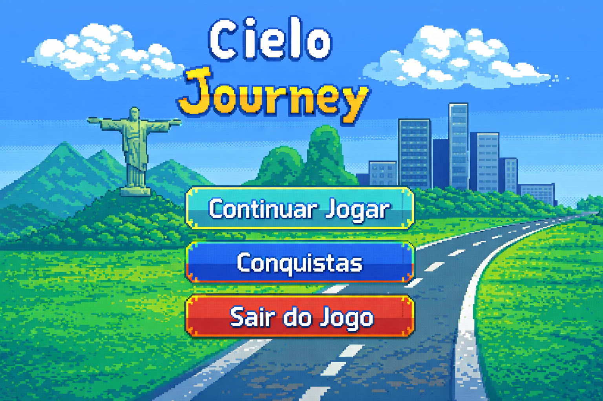 
  Fonte: Autores/Gemini

 

Essa imagem é um prototipo da nossa ideia final, possuindo os botões: Iniciar; conquistas; sair do jogo. O botão de iniciar será implementado para possibilitar o usuário iniciar sua experiência no jogo ou continuar seu progresso de onde parou. O botão de conquistas será utilizado para trazer facilidade ao jogador no que condiz no acesso a suas vitórias, conquistas e prêmios. O botão "Sair do jogo" possibilitará que o jogador saia do jogo e tenha seu progresso.(imagem gerada por inteligência artificial)\*
 

  Imagem prototipo 
  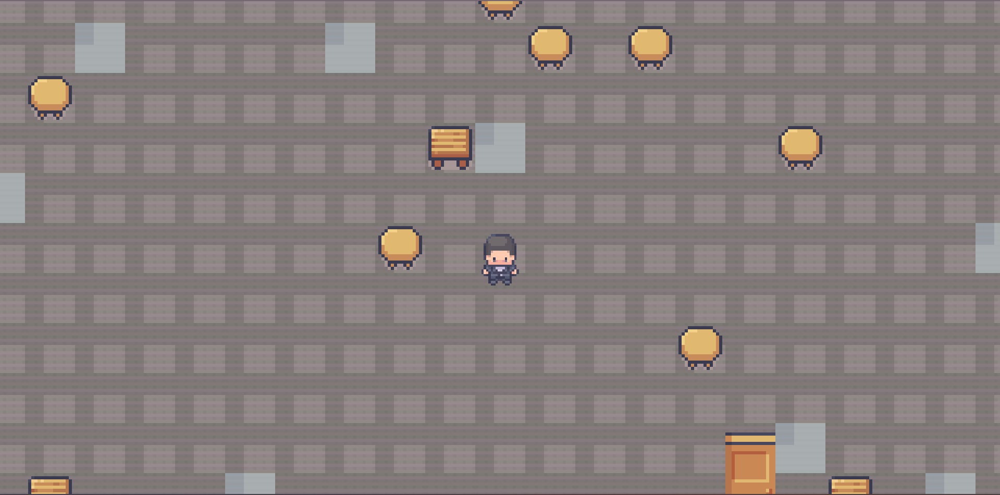 
  Fonte: Autores

 

A imagem acima é uma representação real do personagem e o mundo que será usado para criar todos os cenários. Os objetos no fundo da cena servem de teste para colisões e futuras estruturas de interação, como casas e estabelecimentos comerciais.
 

O desenvolvimento desta cena foi pensada somente para testes, tanto de processamento quanto de movimenação de câmera, por isso ele foi gerado de forma procedural.

Primeiramente pensamos em apenas um mundo pequeno, mas era necessário fazer um mapGrid em uma matriz, normalmente de 64x64 para gerar, e alteravamos os estado de 0: chão, 1: mesa, 2: cadeira, 3: colisão simples. Mas se tornava muito inviável, então por enquanto utilizamos um mapa procedural, e futuramente, a implementação do mapa será realizada por meio de software, e não voltar ao mapGrid.

  Idle 
   
  Fonte: Autores

 

Essa imagem representa o spritesheet de um dos prototipos que será usado no desenvolvimento do jogo, apresentando o estilo feminino de personagem, alinhadas com as cores da Cielo.
 

  Prototipo de alteração de cenário 
  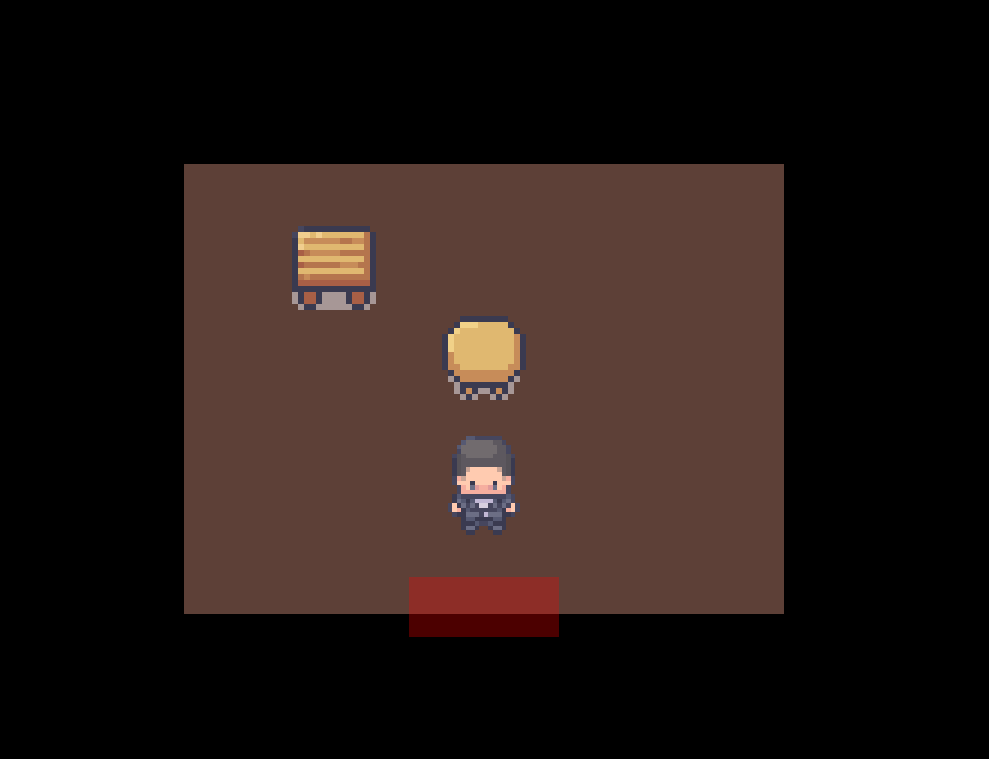 
  Fonte: Autores

 

A representação acima demonstra o personagem dentro de um prototipo de alteração de cenário. Seja dentro de uma casa ou estabelecimento. A hitbox de saída está representada pelo quadrado vermelho e será usado para migrar entre missão/mundo livre.

Esse desenvolvimento foi feito a fim de testes de como o jogo se comporta com mudanças de cenário constante e para já ter um sistema pronto dentro do worldManager de novos cenários e mudanças deles.
 

  Mobile 
  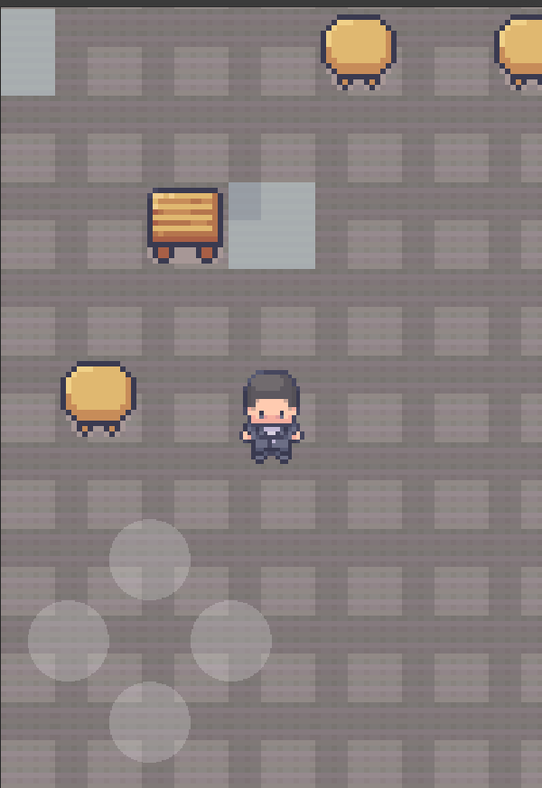 
  Fonte: Autores

 

A imagem acima demonstra o layout de gameplay para dispositivos móveis. Foi pensado esse layout para permitir que todos os Gerentes de Negócios da Cielo tivessem acesso ao jogo digital, e que fosse possível romper as barreiras tecnológicas e geográficas.

O desenvolvimento foi feito dentro de Player, pois é uma feature de movimentação, e não de animação. A única mudança nesta seção foi a implementação de um botão quando identificado que o navegador é mobile, e este botão, utiliza as mesmas funções dos direcionais do teclado, para a movimentação.

## 4.2. Desenvolvimento básico do jogo (sprint 2)

Durante a sprint 2, foi elaborado os sprites dos personagens principais do jogo "Jornada Cielo". Além disso, os personagens foram implementados no jogo, validando a mecânicas adicionadas e possíveis correções de pixels. A inteface que indica as formas de jogo também foi adicionada durante a sprint, possibilitando melhor acessibilidade para os usuários. GameFlow também foi criado para possiblitar melhor visualização do roteiro do "Jornada Cielo".

  Personagens 
   
  Fonte: Autores

 

Atualização da tela inicial. Fundo adicionado para melhorar a experiência visual e combinar com os padrões de cores da Cielo.
 

  Personagens 
  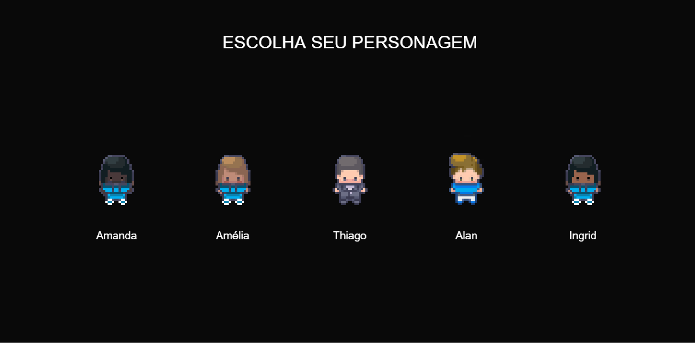 
  Fonte: Autores

 

Pesonagens adicionados para possibilitar inclusão e representatividade para os jogadores.
 

  Primeiro ambiente do jogo 
  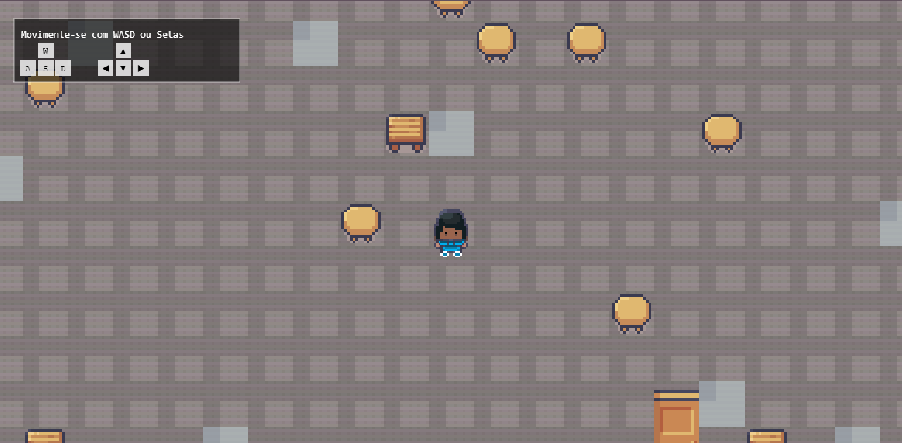 
  Fonte: Autores

 

Primeiro ambiente do jogo, mostrando o tutorial de movimentação.
 

  Configurações 
  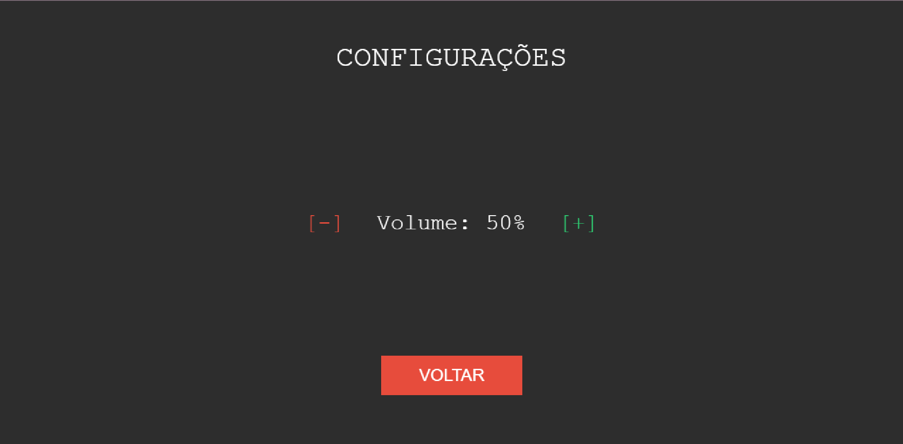 
  Fonte: Autores

 

Imagem que representa o que aparece na aba de configurações.
 

  Tela de configurações 
   
  Fonte: Autores

 

  Tela Inicial - Mobile 
  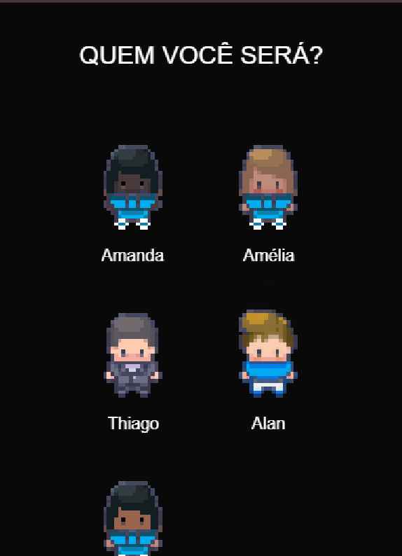 
  Fonte: Autores

 

  Seleção de personagem - Mobile 
  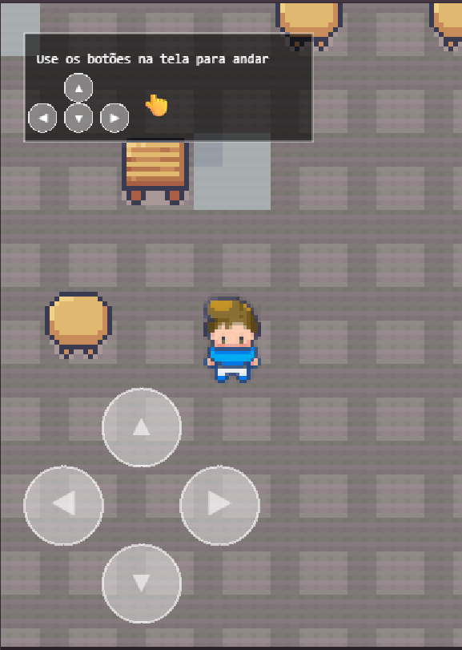 
  Fonte: Autores

 

Imagens que apresentam o jogo quando jogado por dispositivos móveis.

## 4.3. Desenvolvimento intermediário do jogo (sprint 3)

Durante a sprint 3, o projeto **Jornada Cielo** avançou significativamente em relação ao protótipo inicial, incorporando novos sistemas de jogabilidade, melhorias na interface do usuário e uma estrutura de código mais organizada. Essa etapa teve como foco ampliar as funcionalidades do jogo e consolidar a arquitetura do projeto, permitindo maior integração entre exploração do ambiente, interação com personagens e progressão do jogador.

### Implementação de novos sistemas de jogo

Nesta etapa foram adicionados sistemas que ampliam a profundidade da jogabilidade e contribuem para o objetivo educacional do jogo, que é simular situações de negociação enfrentadas por profissionais da área comercial.

Entre os principais sistemas implementados estão:

- **Sistema de conversa com NPCs**, permitindo que o jogador interaja com personagens presentes nos mapas do jogo;
- **Sistema de convencimento**, utilizado durante interações com NPCs para simular negociações e tomadas de decisão;
- **Sistema de confiança**, que atua como um fator multiplicador nas chances de sucesso durante as interações de convencimento;
- **Sistema de experiência (XP) e níveis**, responsável pela progressão do jogador ao longo da jornada;
- **Sistema de inventário**, que permite armazenar e gerenciar itens obtidos durante a exploração;
- **Sistema de bússola**, utilizado para auxiliar a navegação do jogador dentro dos mapas.

Esses sistemas estabelecem a base da progressão e das interações do jogador, permitindo que a experiência do jogo evolua para desafios mais complexos nas próximas etapas do desenvolvimento.

### Melhorias na interface e na experiência do usuário

Além da implementação de novos sistemas, foram realizadas melhorias na interface do jogo com o objetivo de tornar a experiência do usuário mais clara e intuitiva.

Entre as principais melhorias implementadas estão:

- **Adição de uma HUD de feedback**, responsável por apresentar informações importantes sobre as ações do jogador;
- **Melhorias no sistema de seleção de personagens**, tornando o processo mais claro e acessível;
- **Aprimoramento das HUDs para dispositivos móveis**, garantindo melhor adaptação da interface para diferentes tamanhos de tela.

Essas melhorias contribuem para tornar a interação do jogador com o sistema mais fluida e acessível.

### Expansão dos ambientes do jogo

Durante essa sprint também foram adicionados novos mapas ao jogo, ampliando os ambientes exploráveis e diversificando os cenários de interação com NPCs.

Os ambientes atualmente implementados incluem:

- **City** – ambiente urbano;
- **Farm** – ambiente rural;
- **Beach** – ambiente litorâneo;
- **Industrial** – ambiente industrial;
- **Cielo** – ambiente corporativo inspirado no contexto da empresa.

A presença de diferentes cenários contribui para representar variados contextos de interação comercial, enriquecendo a experiência do jogador e permitindo maior diversidade nas situações simuladas.

### Organização e estrutura do código

Durante essa etapa também foram realizadas melhorias significativas na organização e qualidade do código do projeto.

O projeto passou por uma **reestruturação da organização de pastas**, separando os diferentes componentes do jogo em módulos específicos, como:

- **core**, responsável pelas configurações globais e carregamento inicial de recursos do jogo;
- **entities**, que define as entidades principais, como jogador e NPCs;
- **managers**, responsáveis por gerenciar sistemas como animações, diálogos e marcadores;
- **data**, que armazena dados estruturados do jogo, como informações de batalhas e NPCs;
- **scenes**, que organiza as diferentes cenas do jogo, incluindo mapas, menus, combate e interface.

Essa organização modular facilita a manutenção do código, melhora a clareza da estrutura do projeto e contribui para o desenvolvimento colaborativo.

Além disso, também foram realizadas melhorias na **documentação do código**, bem como ajustes gerais para aprimorar sua organização e qualidade.

### Consolidação da base do projeto

Com a implementação desses sistemas, melhorias na interface e reorganização da estrutura de código, o projeto passou a contar com uma base técnica mais robusta e preparada para a expansão das mecânicas de jogo.

Essa etapa foi fundamental para integrar exploração de mapas, interação com NPCs e sistemas de progressão, estabelecendo os elementos centrais que sustentam a experiência do jogador em **Jornada Cielo** e preparando o projeto para futuras evoluções nas próximas sprints.

## 4.4. Desenvolvimento final do MVP (sprint 4)

## 4.4. Finalização do MVP (Sprint 4)

### 4.4.1. Visão Geral

Nesta etapa, o projeto evoluiu de um protótipo funcional para um MVP (Minimum Viable Product) jogável, estável e validável, com integração completa das principais mecânicas.

O jogo encontra-se atualmente:

- Executável via navegador (GitLab Pages)
- Estruturado modularmente
- Estável para uso contínuo
- Preparado para testes com usuários externos

Essa etapa consolida a transição de um sistema técnico para um produto interativo com proposta educacional aplicada ao contexto da Cielo e treinamento dos Gerentes de Vendas.

  Tela inicial do jogo 
  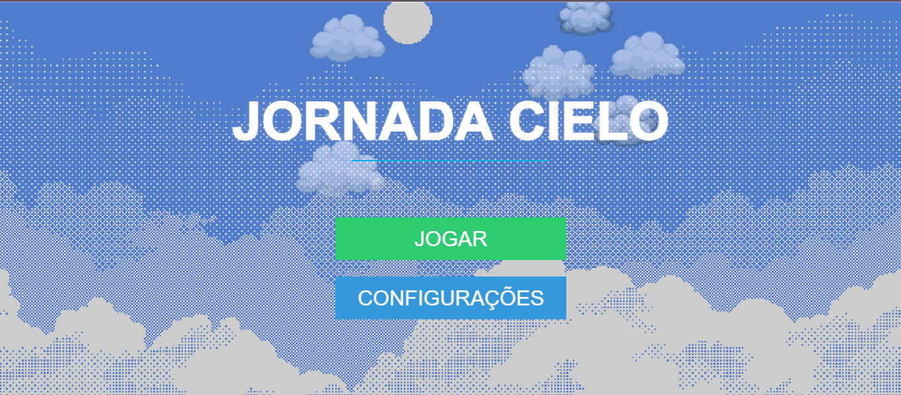 
  Fonte: Autores

 

  Primeiro ambiente do jogo após o tutorial 
  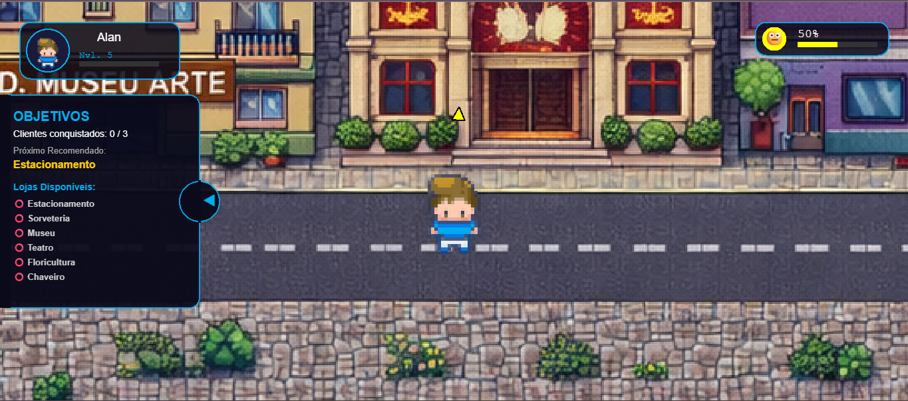 
  Fonte: Autores

 

---

### 4.4.2. Funcionalidades Implementadas

As principais mecânicas do jogo foram implementadas e integradas:

- Sistema de movimentação entre mapas com transições bidirecionais
- Sistema de interação com NPCs baseado em proximidade
- Orientação por bússolas e um HUD de próximos objetivos
- Sistema de diálogo dinâmico com múltiplas opções
- Sistema de negociação (NegotiationScene), incluindo:
  - Argumentos com impacto variável
  - Retóricas dos clientes que o jogador deve responder corretamente
  - Sistema de Ajuda por meio do S.O.S. Cielo
  - Penalização por repetição
  - Modificador baseado em confiança
  - Variação aleatória (RNG)
- Sistema de inventário com itens consumíveis (Variáveis e CieloDex):
  - CieloDex: sistema que salva os itens-chave do jogador e os clientes satisfeitos conquistados
- Sistema de XP e progressão de níveis
- Sistema de confiança (influência direta na negociação)
- HUD persistente (PlayerHudScene)
- HUD mobile com joystick analógico e botões contextuais
- Sistema de feedback visual (floating text, animações, efeitos)

As funcionalidades estão integradas entre si, garantindo consistência na experiência do jogador.

  Tela de negociação 
  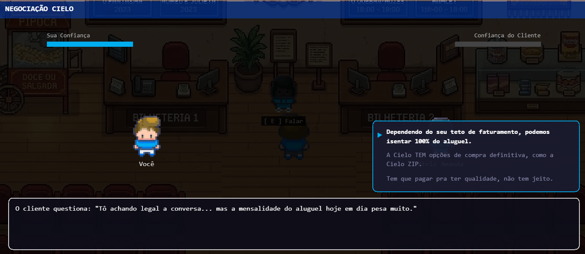 
  Fonte: Autores

 

---

### 4.4.3. Testabilidade do Produto

O jogo foi estruturado para permitir testes internos e externos de forma segura.

#### ✔️ Execução sem erros

- Execução com parâmetros padrão sem falhas
- Execução com diferentes fluxos de navegação entre cenas
- Transições protegidas por controle de estado (`isTransitioning`)

#### ✔️ Tratamento de erros e salvaguardas

- Verificação de carregamento de assets antes da execução
- Validação da existência de parâmetros críticos (ex: `negotiationId`); caso contrário, atribuição de valor padrão ou forçando crash controlado
- Controle de interações inválidas (ex: diálogo já aberto, música já tocando)
- Normalização de movimento para evitar vantagem diagonal
- Prevenção de múltiplos gatilhos simultâneos

#### ✔️ Limitações identificadas (transparência técnica)

- Inconsistência de ID em NPC da cena industrial (não impacta execução, mas afeta UX)
- Ausência de algumas implementações de mapas internos (integração futura)

---

### 4.4.4. Publicação e Acesso

O projeto foi disponibilizado para acesso externo:

- Código versionado em repositório Git
- Deploy realizado via GitLab Pages
- Acesso direto via navegador (sem necessidade de instalação)

Isso permite:

- Testes por avaliadores
- Validação com usuários externos
- Demonstração do produto em ambiente real

---

### 4.4.5. Organização Técnica do Código

O projeto segue uma arquitetura modular bem definida:

#### Estrutura de Pastas

- `core/` → Configuração e inicialização
- `entities/` → Entidades do jogo (Player, NPC)
- `managers/` → Lógica de sistemas e centralização de contextos (NPC, diálogo, animação, navegação)
- `data/` → Dados estruturados (NPCs, negociações)
- `scenes/` → Cenas do jogo (mapas, menus, UI, combate)

#### Padrões adotados

- Uso consistente de `camelCase`
- Métodos privados com prefixo `_`
- Separação clara entre lógica e apresentação
- Reutilização de sistemas (NPCManager, DialogManager, interiorScene)

Essa organização garante:

- Escalabilidade
- Manutenção facilitada
- Clareza estrutural

  Organização das pastas 
  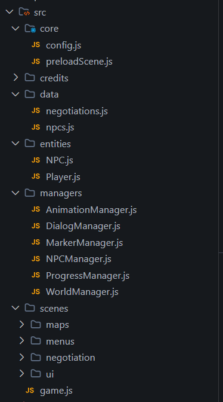 
  Fonte: Autores

 

---

### 4.4.6. Comentários no Código

O código apresenta alto nível de documentação:

- Uso de JSDoc em arquivos e funções
- Definição de tipos e visão geral dos arquivos (`@typedef`, `@fileoverview`)
- Explicação de regras de negócio e lógica interna

Os comentários são:

- Objetivos
- Contextualizados
- Não redundantes

Isso permite que qualquer desenvolvedor compreenda rapidamente o funcionamento do sistema.

  Exemplo de código comentado 
  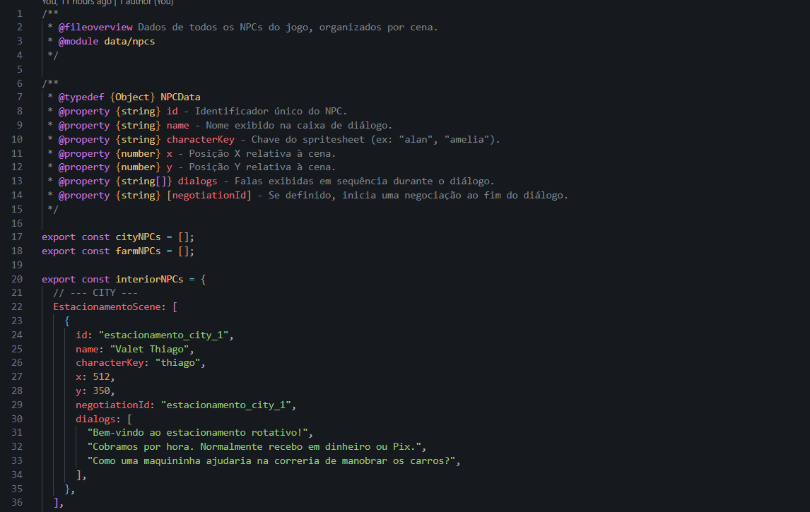 
  Fonte: Autores

 

---

### 4.4.7. Versionamento e Commits

O versionamento foi realizado via Git, com commits organizados por funcionalidades.

#### Pontos positivos

- Uso de prefixos de versão
- Registro das principais evoluções do projeto

#### Ponto de melhoria identificado

- Commits monolíticos (muito grandes)
- Concentração de commits em um único integrante

#### Plano de melhoria adotado

- Divisão de commits por funcionalidade (ex: inventário, batalha, HUD)
- Padronização de mensagens (`feat`, `fix`, `refactor`)
- Associação com issues do Kanban

**Exemplo esperado:**

`feat: [versão] [funcionalidade] Adicionando sistema de inventário #23`

Essa melhoria visa aumentar a rastreabilidade e colaboração da equipe.

---

### 4.4.8. Qualidade de Execução

O sistema apresenta alto nível de estabilidade:

- Execução contínua sem falhas críticas
- Ausência de erros no console em fluxo normal
- Comportamento consistente entre cenas
- Integração funcional entre sistemas

**Destaque técnico:**

- Sistema de negociação robusto e validável
- HUD reativa ao estado global do jogador
- Bússola dinâmica com orientação espacial

---

### 4.4.9. Gestão do Processo (Scrum)

Durante a Sprint 4:

- Uso ativo de Kanban para gestão de tarefas
- Todas as issues da sprint anterior foram concluídas
- Participação do grupo em cerimônias:
  - Daily
  - Planning
  - Review

**Ponto de atenção:**

- Necessidade de maior distribuição de commits entre membros

---

### 4.4.10. Participação da Equipe

A participação foi evidenciada por:

- Desenvolvimento técnico (código)
- Discussões de arquitetura
- Definição de mecânicas e UX

**Evolução esperada:**

- Maior evidência individual no repositório (commits)
- Melhor distribuição das entregas técnicas

---

### 4.4.11 Considerações Finais

O MVP entregue apresenta:

- Mecânicas principais completas e integradas
- Estabilidade técnica consistente
- Arquitetura modular escalável dentro das limitações do Phaser
- Sistema central (negociação) funcional e validável
- Preparação real para testes com usuários

Além disso, o projeto demonstra:

- Capacidade de evolução contínua
- Identificação clara de melhorias
- Alinhamento entre proposta educacional e execução técnica
- Conteúdo facilmente alterável e escalável para testes e treinamentos

O jogo **Jornada Cielo** encontra-se pronto para validação externa e iteração baseada em feedback real.

## 4.5. Revisão do MVP (sprint 5)

_Descreva e ilustre aqui o desenvolvimento dos refinamentos e revisões da versão final do jogo, explicando brevemente o que foi entregue em termos de MVP. Utilize prints de tela para ilustrar._

# 5. Casos de Teste

## 5.1. Casos de Teste (sprints 2 a 4)

Nesta seção são descritos **casos de teste (CT)** utilizados para verificar se as principais funcionalidades do jogo **Jornada Cielo** estão funcionando corretamente e se as diferentes partes do sistema estão integradas.

Os testes foram elaborados considerando o **estado atual do protótipo**, focando na validação das funcionalidades já implementadas, como carregamento do jogo, navegação entre telas, seleção de personagem, movimentação e exploração do mapa de tutorial.

Os testes podem ser executados em diferentes momentos do desenvolvimento para garantir que:

- as telas carreguem corretamente;
- a navegação entre as cenas funcione como esperado;
- os controles do jogador respondam adequadamente;
- o personagem interaja corretamente com o ambiente do mapa.

A tabela a seguir apresenta os principais casos de teste utilizados durante o desenvolvimento.

| #    | Pré-condição                                                   | Descrição do teste                                                                | Pós-condição                                                                                   |
| ---- | -------------------------------------------------------------- | --------------------------------------------------------------------------------- | ---------------------------------------------------------------------------------------------- |
| CT1  | 1. O jogador acessa o jogo no navegador.                       | 1. Executar o jogo. 2. Aguardar o carregamento inicial.                        | Os recursos do jogo devem ser carregados corretamente e o **menu principal** deve ser exibido. |
| CT2  | 1. O jogo está na tela de menu principal.                      | 1. Clicar no botão **Iniciar Jogo**.                                              | O sistema deve carregar a **tela de seleção de personagem**.                                   |
| CT3  | 1. O jogador está na tela de seleção de personagem.            | 1. Selecionar um personagem disponível. 2. Confirmar a escolha.                | O jogo deve carregar o **mapa de tutorial ambientado no GEO** com o personagem selecionado.    |
| CT4  | 1. O jogador está dentro do mapa de tutorial.                  | 1. Pressionar as teclas **W, A, S, D**. 2. Observar o movimento do personagem. | O personagem deve se mover nas direções correspondentes aos comandos pressionados.             |
| CT5  | 1. O jogador está próximo a uma parede ou objeto do cenário.   | 1. Movimentar o personagem em direção ao obstáculo.                               | O personagem não deve atravessar o objeto, respeitando o **sistema de colisão do mapa**.       |
| CT6  | 1. O jogo está no menu principal.                              | 1. Clicar na opção **Configurações**.                                             | A **tela de configurações** deve ser exibida.                                                  |
| CT7  | 1. O jogador está na tela de configurações.                    | 1. Alterar uma configuração disponível (por exemplo volume ou opção visual).      | A alteração deve ser aplicada ao jogo e refletida no sistema.                                  |
| CT8  | 1. O jogador está em uma tela secundária (como configurações). | 1. Utilizar o botão **Voltar** ou equivalente.                                    | O jogo deve retornar corretamente ao **menu principal**.                                       |
| CT9  | 1. O jogador está no mapa de tutorial.                         | 1. Explorar o cenário movimentando o personagem por diferentes áreas do mapa.     | O personagem deve se mover livremente dentro dos limites definidos pelo mapa.                  |
| CT10 | 1. O jogo foi iniciado normalmente.                            | 1. Navegar entre as telas principais (menu → seleção de personagem → jogo).       | A transição entre as **cenas do jogo** deve ocorrer sem erros ou travamentos.                  |

Esses testes ajudam a garantir que os principais sistemas do jogo — como **carregamento inicial, navegação entre cenas, seleção de personagem, movimentação do jogador e colisões do cenário** — estejam funcionando corretamente durante o desenvolvimento e integração do projeto.

## 5.2. Testes de jogabilidade (playtests) (sprint 5)

### 5.2.1 Registros de testes

| Nome                                     | Avaliador 1                                                                                                    |
| ---------------------------------------- | -------------------------------------------------------------------------------------------------------------- |
| Já possuía experiência prévia com games? | Sim, já possuía experiência prévia, com jogos parecidos (Pokémon)                                              |
| Conseguiu iniciar o jogo?                | Sim                                                                                                            |
| Entendeu as regras e mecânicas do jogo?  | Entendeu as regras, mas sobre as mecânicas, não explorou os comandos complexos, como organização do inventário |
| Conseguiu progredir no jogo?             | Sim                                                                                                            |
| Apresentou dificuldades?                 | Sim, no início sentiu falta de uma descrição que contasse o roteiro que deveria ser seguido                    |
| Que nota deu ao jogo?                    | 8.0                                                                                                            |
| O que gostou no jogo?                    | Gostou do design dos mapas, elogiou a dinâmica de negociação com o cliente                                     |
| O que poderia melhorar no jogo?          | Adicionar o enter como seletor, tutorial inícial, tamanho da fonte e a velociadade da conversa (reduzir)       |

| Nome                                     | Avaliador 2                                                                                                                                 |
| ---------------------------------------- | ------------------------------------------------------------------------------------------------------------------------------------------- |
| Já possuía experiência prévia com games? | Sim, porém era mais ligado aos jogos de FPS                                                                                                 |
| Conseguiu iniciar o jogo?                | Sim                                                                                                                                         |
| Entendeu as regras e mecânicas do jogo?  | Entendeu as regras e mecânica principal do jogo, porém não utilizou o inventário e o guia de tarefas                                        |
| Conseguiu progredir no jogo?             | Sim                                                                                                                                         |
| Apresentou dificuldades?                 | Sim, não soube utilizar das informações do tutorial para guiá-lo no jogo. Sentiu dificuldade em entender como funcionava o seletor de mundo |
| Que nota deu ao jogo?                    | 7.5                                                                                                                                         |
| O que gostou no jogo?                    | Gostou dos sprites e do funcionamento do inventário                                                                                         |
| O que poderia melhorar no jogo?          | Adicionar uma fonte maior nas interações                                                                                                    |

| Nome                                     | Avaliador 3                                                                                           |
| ---------------------------------------- | ----------------------------------------------------------------------------------------------------- |
| Já possuía experiência prévia com games? | Sim, já possuía experiência prévia com jogos 2D no estilo Mario e Pokémon                             |
| Conseguiu iniciar o jogo?                | Sim                                                                                                   |
| Entendeu as regras e mecânicas do jogo?  | Entendeu as regras e mecânicas com facilidade                                                         |
| Conseguiu progredir no jogo?             | Sim                                                                                                   |
| Apresentou dificuldades?                 | Não, conseguiu progredir sem dificuldades                                                             |
| Que nota deu ao jogo?                    | 10.0                                                                                                  |
| O que gostou no jogo?                    | Gostou do design dos mapas, elogiou a dinâmica de negociação com o cliente e da progressão das fases. |
| O que poderia melhorar no jogo?          | Mudar a ordem das alternativas da negociação para melhor fluidez                                      |

| Nome                                     | Avaliador 4                                                                                |
| ---------------------------------------- | ------------------------------------------------------------------------------------------ |
| Já possuía experiência prévia com games? | Não, jogadora casual                                                                       |
| Conseguiu iniciar o jogo?                | Sim                                                                                        |
| Entendeu as regras e mecânicas do jogo?  | Parcialmente, com algumas dificuldades                                                     |
| Conseguiu progredir no jogo?             | Sim, com algumas dificuldades                                                              |
| Apresentou dificuldades?                 | Sim, nas mecânicas de convencimento e na orientação pelo mapa                              |
| Que nota deu ao jogo?                    | 6.0                                                                                        |
| O que gostou no jogo?                    | Gostou do sistema de perguntas e respostas, design do mundo da praia                       |
| O que poderia melhorar no jogo?          | Aumentar o tempo da passagem de resposta do cliente, sistema de colisões, tamanho dos NPCS |

### 5.2.2 Melhorias

- Adicionar o enter como seletor
- tutorial inícial
- tamanho da fonte e a velociadade da conversa (reduzir)
- Adicionar uma fonte maior nas interações
- Mudar a ordem das alternativas da negociação para melhor fluidez
- Aumentar o tempo da passagem de resposta do cliente
- sistema de colisões
- tamanho dos NPCS

# 6. Conclusões e trabalhos futuros (sprint 5)

_Escreva de que formas a solução do jogo atingiu os objetivos descritos na seção 1 deste documento. Indique pontos fortes e pontos a melhorar de maneira geral._

_Relacione os pontos de melhorias evidenciados nos testes com plano de ações para serem implementadas no jogo. O grupo não precisa implementá-las, pode deixar registrado aqui o plano para futuros desenvolvimentos._

_Relacione também quaisquer ideias que o grupo tenha para melhorias futuras_

# 7. Referências (sprint 5)

Banco Central do Brasil. (2020). Pix: O meio de pagamento instantâneo brasileiro.  
https://www.bcb.gov.br/estabilidadefinanceira/pix

Banco Central do Brasil. (2023). Relatório de Economia Bancária 2023.  
https://www.bcb.gov.br

Cielo S.A. (2024). Relações com investidores.  
https://ri.cielo.com.br

CNN Brasil. (2022). A “guerra das maquininhas” acabou? Entenda para onde vai o mercado de pagamentos.  
https://www.cnnbrasil.com.br

PortersFiveForce.com. (2024). Competitive landscape of Cielo company.  
https://portersfiveforce.com/blogs/competitors/cielo

PortersFiveForce.com. (2024). Cielo SWOT analysis – Pix and fintech disruption.  
https://portersfiveforce.com/products/cielo-swot-analysis

Prudenciano, G. (2025, 26 junho). Destronada nas maquininhas, Cielo luta para se manter relevante na era do Pix. InvestNews.  
https://investnews.com.br/negocios/destronada-nas-maquininhas-cielo-luta-para-se-manter-relevante-na-era-do-pix/

Reuters. (2024, 2 abril). Brazil’s Pix payments are transforming the payments market.  
https://www.reuters.com

Teles, B. (2025, 09 agosto). Cielo perde liderança histórica na ‘guerra das maquininhas’ após avanço de concorrentes, novas regras do Banco Central e ascensão do Pix. Click Petróleo e Gás.  
https://clickpetroleoegas.com.br/cielo-perde-lideranca-historica-na-guerra-das-maquininhas-apos-avanco-de-concorrentes-novas-regras-do-banco-central-e-ascensao-do-pix-btl96/

UOL Economia. (2024, 6 fevereiro). Por que a Cielo vai fechar capital e o que acontece com o acionista.  
https://economia.uol.com.br

UOL Economia. (2024, 6 fevereiro). Por que a Cielo vai fechar capital e o que acontece com o acionista. https://economia.uol.com.br

NUSSENZVEIG, Herch Moysés. **Curso de física básica: mecânica (volume 1)**. 5. ed. São Paulo: Blucher, 2013.

# Anexos

_Inclua aqui quaisquer complementos para seu projeto, como diagramas, imagens, tabelas etc. Organize em sub-tópicos utilizando headings menores (use ## ou ### para isso)_
